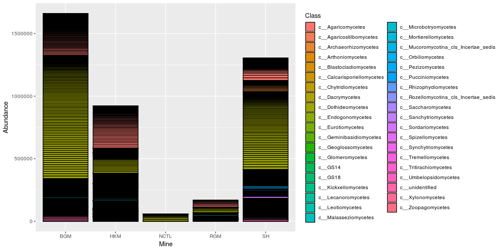
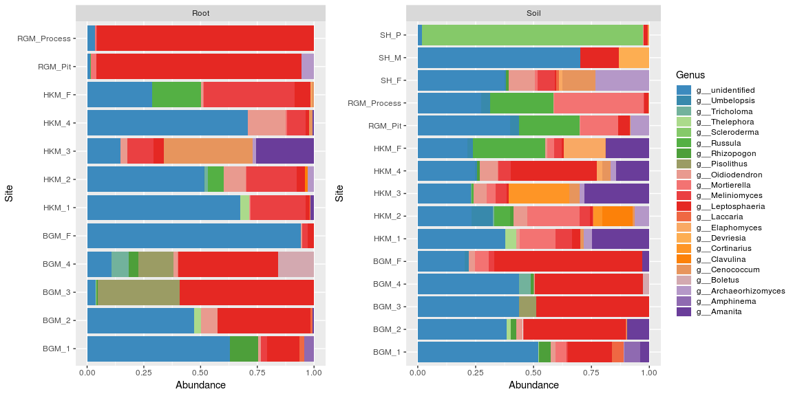
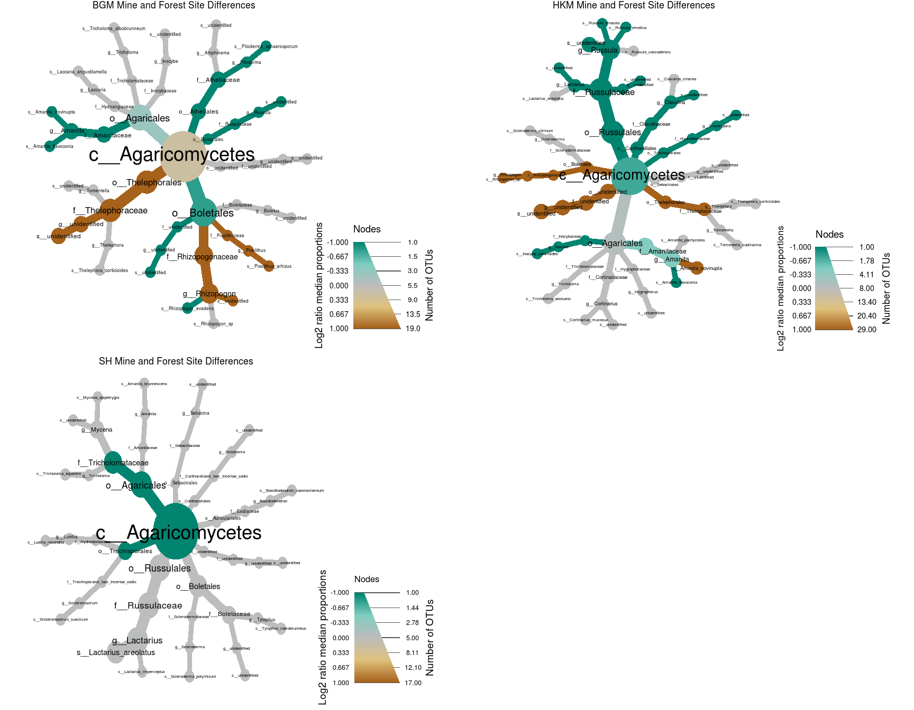
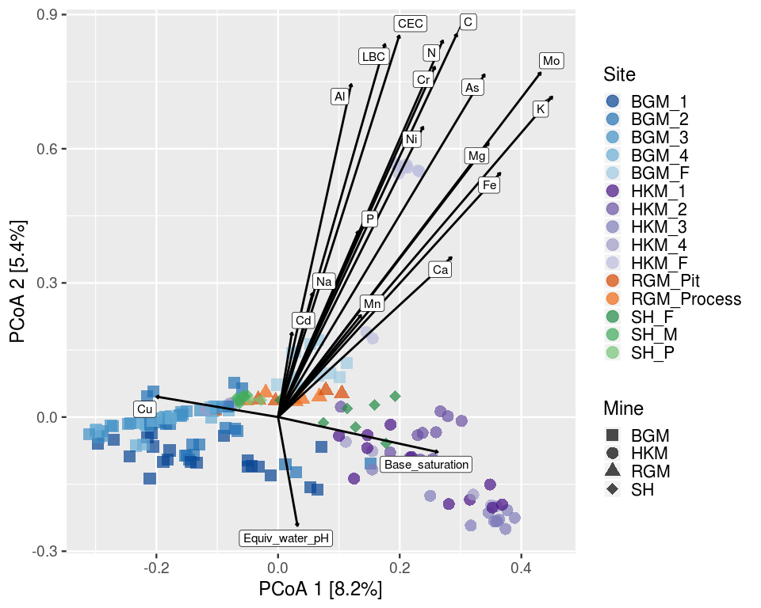

# Importing data and pre-processing


```r
library(phyloseq)
library(ggplot2)
library(tidyverse)
library(RColorBrewer)
library(cowplot)
library(metacoder)
library(dplyr)
library(vegan)
library(knitr)
library(kableExtra)
library(ggrepel)

all_data0 <- import_biom(BIOMfilename = "all_otu_table_mapping.tax.sample2.biom")
all_data0
```

```
## phyloseq-class experiment-level object
## otu_table()   OTU Table:         [ 2112 taxa and 282 samples ]
## sample_data() Sample Data:       [ 282 samples by 38 sample variables ]
## tax_table()   Taxonomy Table:    [ 2112 taxa by 7 taxonomic ranks ]
```

## Checking sequencing depth


```r
# Make a data frame with a column for the read counts of each sample
sample_sum_df <- data.frame(sum = sample_sums(all_data0))
# Histogram of sample read counts
ggplot(sample_sum_df, aes(x = sum)) + 
  geom_histogram(color = "black", fill = "indianred", binwidth = 2500) +
  ggtitle("Distribution of sample sequencing depth") + 
  xlab("Read counts") +
  theme_gray() + theme(axis.title.y = element_blank())
```

<!-- -->

## Standardizing by sequencing depth


```r
#Standardize abundances to the median sequencing depth
total <- median(sample_sums(all_data0))
standf <- function(x, t=total) round(t * (x/sum(x)))
all_data0.std <- transform_sample_counts(all_data0, standf)
#Filter taxa with cutoff 3.0 Coefficient of Variation
#BGM_data0.stdf <- filter_taxa(BGM_data0.std, function(x) sd(x)/mean(x) > 3.0, TRUE)
```

## Filtering "no hits"


```r
#Renaming taxonomy levels on tax_table
colnames(tax_table(all_data0.std)) <- c("Kingdom", "Phylum", "Class","Order", "Family", "Genus", "Species")
#Filtering no hit at Kingdom level
all_data <- subset_taxa(all_data0.std, Kingdom != "No blast hit")
```

# Taxa abudance at different rank levels


```r
#summarizing by tax rank
all.class <- tax_glom(all_data, "Class")
plot_bar(all.class, fill = "Class", x = "Mine") + theme_gray()
```

```
## Warning in psmelt(physeq): The sample variables: 
## Sample
##  have been renamed to: 
## sample_Sample
## to avoid conflicts with special phyloseq plot attribute names.
```



## Subsetting datasets by study

```r
#Silvehill dataset
SH_data <- subset_samples(all_data, grepl("SH", sample_data(all_data)$Mine))
SH_field <- subset_samples(SH_data, grepl("Field", sample_data(SH_data)$Collection))
SH_mine <- subset_samples(SH_field, grepl("Mine", sample_data(SH_field)$Treatment))

#BGM dataset
BGM_data <- subset_samples(all_data, grepl("BGM", sample_data(all_data)$Mine))
BGM_field <- subset_samples(BGM_data, grepl("Field", sample_data(BGM_data)$Collection))
BGM_mine <- subset_samples(BGM_field, grepl("Mine", sample_data(BGM_field)$Treatment))

#HKM dataset
HKM_data <- subset_samples(all_data, grepl("HKM", sample_data(all_data)$Mine))
HKM_field <- subset_samples(HKM_data, grepl("Field", sample_data(HKM_data)$Collection))
HKM_mine <- subset_samples(HKM_field, grepl("Mine", sample_data(HKM_field)$Treatment))

#RGM dataset
RGM_data <- subset_samples(all_data, grepl("RGM", sample_data(all_data)$Mine))

#Mines (four mines field data combined)
Mines_data <- subset_samples(all_data, grepl("Field", sample_data(all_data)$Collection))
```

## Different mines field samples analyzed together
## Relative abudance of genus and class in different mine soil and root samples


```r
TopNOTUs <- function(sample,N) {
  names(sort(taxa_sums(sample), TRUE)[1:N])
}
#Creating data frame from phyloseq object
top.Mines <- TopNOTUs(Mines_data, 100)
Mines.df <- prune_taxa(top.Mines, Mines_data) %>% psmelt()
#Sumarize data by site 
#test <- BGM.df %>% group_by(Genus) %>% summarise(sum(Abundance))
#plot by relative abundance
#Plot

pal <- colorRampPalette((brewer.pal(10, "Paired")))

## Genus plot root vs soil
Genus_soil <- ggplot(data = filter(Mines.df, Type == "Soil"), aes(Site, Abundance, fill = Genus)) +
  geom_bar(stat = "identity", position = position_fill()) + coord_flip() +
    scale_fill_manual(values = (rev(pal(24)))) + 
    guides(fill = guide_legend(reverse = TRUE, ncol = 1, keyheight = 0.8)) +
    facet_grid(~ Type, drop = TRUE) +
   theme(text = element_text(size = 15)) + theme_gray()

Genus_root <- ggplot(data = filter(Mines.df, Type == "Root"), aes(Site, Abundance, fill = Genus)) +
  geom_bar(stat = "identity", position = position_fill()) + coord_flip() +
    scale_fill_manual(values = rev(pal(24))) + 
    guides(fill = FALSE) +
    facet_grid(~ Type, drop = TRUE) +
   theme(text = element_text(size = 15)) + theme_gray()

plot_grid(Genus_root, Genus_soil, align = "h", rel_widths = c(1,1.4))
```



```r
## Class plot root vs soil
Class_soil <-ggplot(data = filter(Mines.df, Type == "Soil"), aes(Site, Abundance, fill = Class)) +
  geom_bar(stat = "identity", position = position_fill()) + coord_flip() +
  scale_fill_manual(values = (pal(24))) + 
  guides(fill = guide_legend(ncol = 1, keyheight = 0.8)) +
  facet_grid(~ Type, drop = TRUE) +
  theme(text = element_text(size = 15)) + theme_gray()

Class_root <-ggplot(data = filter(Mines.df, Type == "Root"), aes(Site, Abundance, fill = Class)) +
  geom_bar(stat = "identity", position = position_fill()) + coord_flip() +
  scale_fill_manual(values = (pal(24))) + 
  guides(fill = FALSE) +  
  facet_grid(~ Type, drop = TRUE) +
  theme(text = element_text(size = 15)) + theme_gray()

plot_grid(Class_root, Class_soil, align = "h", rel_widths = c(1,1.4))
```


```r
##Trying to stack the genus that belongs to the same class close to each other; also mannually set color so that the genus that belongs to the same class will be grouped in the same group of color

Mines.df$Genus <-  ordered(Mines.df$Genus, levels = c("g__unidentified", "g__Umbelopsis", "g__Mortierella","g__Meliniomyces", "g__Oidiodendron", "g__Elaphomyces", "g__Leptosphaeria", "g__Devriesia", "g__Cenococcum", "g__Archaeorhizomyces", "g__Thelephora",  "g__Russula", "g__Clavulina",  "g__Amphinema", "g__Scleroderma", "g__Rhizopogon", "g__Pisolithus", "g__Boletus", "g__Tricholoma", "g__Laccaria", "g__Cortinarius", "g__Amanita"))

Genus_soil <- ggplot(data = filter(Mines.df, Type == "Soil")) +
    geom_bar(aes(Site, Abundance, fill = Genus), stat = "identity", position = position_fill()) +
    coord_flip() +
    scale_fill_manual(values = rev(pal(24))) +
    guides(fill = guide_legend(reverse = TRUE, ncol = 1, keyheight = 0.8)) +
    facet_grid(~ Type, drop = TRUE) + 
    theme(text = element_text(size = 15)) + theme_gray()

Genus_root <- ggplot(data = filter(Mines.df, Type == "Root")) +
  geom_bar(aes(Site, Abundance, fill = Genus), stat = "identity", position = position_fill()) + coord_flip() +
    scale_fill_manual(values = rev(pal(24))) +
    #guides(fill = guide_legend(reverse = TRUE, ncol = 1, keyheight = 0.8)) +
    guides(fill = FALSE) +
    facet_grid(~ Type, drop = TRUE) + 
    theme(text = element_text(size = 15)) + theme_gray()

plot_grid(Genus_root, Genus_soil, align = "h", rel_widths = c(0.9,1.3))
```

<!-- -->

```r
#########I am carefully color coding each of the genus that appeared on the previous genus soil and root graph. Agaricales are blue, Boletales are green, and others... But it is very weird that not all genus that appeared on the previous graph appear on this graph.

### You pre-selecting the order of the genera, some your may be discarding some of the genera that appear on the previous graph

###Save in case
# Mines.df$Genus <-  ordered(Mines.df$Genus, levels = c("g__unidentified", "g__Umbelopsis", "g__Mortierella","g__Meliniomyces", "g__Oidiodendron", "g__Elaphomyces", "g__Leptosphaeria", "g__Devriesia", "g__Cenococcum", "g__Archaeorhizomyces", "g__Tricholoma","g__Thelephora", "g__Scleroderma", "g__Russula", "g__Rhizopogon","g__Pisolithus", "g__Laccaria", "g__Cortinarius", "g__Clavulina", "g__Boletus", "g__Amphinema", "g__Amanita"))
# Genus_soil <- ggplot(data = filter(Mines.df, Type == "Soil" & !is.na(Genus))) +
#   geom_bar(aes(Site, Abundance, fill = Genus), stat = "identity", position = position_fill()) + coord_flip() +
#     scale_fill_manual(values = c ("#969696", "#fed976", "#6a51a3", "#fd8d3c", "#d94801","#6baed6", "#2171b5", "#e5f5e0", "#c7e9c0", "#a1d99b", "#74c476", "#41ab5d", "#238b45", "#006d2c", "#00441b")) +
#     guides(fill = guide_legend(reverse = TRUE, ncol = 1, keyheight = 0.8)) +
#     facet_grid(~ Type, drop = TRUE) + 
#     theme(text = element_text(size = 15)) + theme_gray()
# 
# 
# Genus_soil
```

# Creating a table modeled after Huang et al. (2012)
## BGM


```r
#Using BGM_mine dataset to extract top 10 OTUs on the mine sites
top10.BGM <- TopNOTUs(BGM_mine, 25) 
#Extracting the top 10 OTUs is only 3 species

# Transform to relative abundance
#BGM.rel <- transform_sample_counts(BGM_field, function(x) 100 * x/sum(x))
#Then use BGM_field dataset to pull these taxa from both mine sites and forest site
#top10.BGM.df <- prune_taxa(top10.BGM, BGM.rel) %>% psmelt()

top10.BGM.df <- psmelt(BGM_field)
  
#Create data frame
top10.BGM.df %>%
  group_by(Group, Type, Genus) %>% 
  summarise(n = n(),
            Abd = sum(Abundance))
 top10.BGM.df %>%
   group_by(Group) %>%
   summarise(total = sum(Abundance))

top10.BGM.wsum <- merge(top10.BGM.df, sample_sum.std, by.x = "Sample", by.y = "Sample")
top10.BGM.wsum$otu_rel_abd <- (top10.BGM.wsum$Abundance)/(top10.BGM.wsum$sum)*100
top10.BGM.grouped <- group_by(top10.BGM.wsum, Genus, Type, Site)
BGM.genus <- summarise(top10.BGM.grouped, relative_abundance = (sum(Abundance)/sum(sum))*100)
View(BGM.genus)
```

## HKM


```r
#Using HKM_mine dataset to extract top 10 OTUs on the mine sites
top10.HKM <- TopNOTUs(HKM_mine, 10)
#Then use HKM_field dataset to pull these taxa from both mine sites and forest site
top10.HKM.df <- prune_taxa(top10.HKM, HKM_field) %>% psmelt()

top10.HKM.wsum <- merge(top10.HKM.df, sample_sum.std, by.x = "Sample", by.y = "Sample")

top10.HKM.wsum$otu_rel_abd <- (top10.HKM.wsum$Abundance)/(top10.HKM.wsum$sum)*100

top10.HKM.grouped <- group_by(top10.HKM.wsum, Genus, Type, Site)

HKM.genus <- summarise (top10.HKM.grouped, relative_abundance = (sum(Abundance)/sum(sum))*100)

View (HKM.genus)
```

## SH


```r
#Using BGM_mine dataset to extract top 10 OTUs on the mine sites
top10.SH <- TopNOTUs(SH_mine, 10)
#Then use BGM_field dataset to pull these taxa from both mine sites and forest site
top10.SH.df <- prune_taxa(top10.SH, SH_field) %>% psmelt()

top10.SH.wsum <- merge(top10.SH.df, sample_sum.std, by.x = "Sample", by.y = "Sample")

top10.SH.wsum$otu_rel_abd <- (top10.SH.wsum$Abundance)/(top10.SH.wsum$sum)*100

top10.SH.grouped <- group_by(top10.SH.wsum, Genus, Type, Site)

SH.genus <- summarise (top10.SH.grouped, relative_abundance = (sum(Abundance)/sum(sum))*100)

View (SH.genus)
```

## RGM


```r
#RGM_data dataset is used here to extract top 10 OTUs on the mine sites because all RGM samples came from mine sites
top10.RGM <- TopNOTUs(RGM_data, 10)
#Then use BGM_field dataset to pull these taxa from both mine sites and forest site
top10.RGM.df <- prune_taxa(top10.RGM, RGM_data) %>% psmelt()

top10.RGM.wsum <- merge(top10.RGM.df, sample_sum.std, by.x = "Sample", by.y = "Sample")

top10.RGM.wsum$otu_rel_abd <- (top10.RGM.wsum$Abundance)/(top10.RGM.wsum$sum)*100

top10.RGM.grouped <- group_by(top10.RGM.wsum, Genus, Type, Site)

RGM.genus <- summarise (top10.RGM.grouped, relative_abundance = (sum(Abundance)/sum(sum))*100)

View (RGM.genus)
```

## Put the tables together

```r
All.genus <- rbind (BGM.genus, HKM.genus, SH.genus, RGM.genus)
View (All.genus)

unique_genus <- unique (All.genus$Genus)
All.genus.table <- data.frame ("Genus" = unique_genus)
All.genus.soil <- filter(All.genus, Type == "Soil")
All.genus.root <- filter(All.genus, Type == "Root")
list_site <- unique (All.genus$Site)
All.genus$BGM_1_soil <- NA
```


## Metacoder analysis for different mine field soil samples
##BGM
I'd wanna change the color to be brown (mine site) and green (forest site), because it is more intuitive--any suggestion? Do I flip the color range?
__R/__ You only have to change `node_color_range` to invert the colro scale.  I already id, so now Mine is brown and forest sites are green.


```r
#Top 100 OTUs
top100.BGM <- TopNOTUs(BGM_field, 100)
top100.BGM.ps <- prune_taxa(top100.BGM, BGM_field)
#Converting to metacoder
obj.BGM <- parse_phyloseq(top100.BGM.ps)
# Convert counts to proportions
obj.BGM$data$otu_table <- calc_obs_props(obj.BGM,
                                     data = "otu_table",
                                     cols = obj.BGM$data$sample_data$sample_id)
# Calculate per-taxon proportions
obj.BGM$data$tax_table <- calc_taxon_abund(obj.BGM,
                                       data = "otu_table",
                                       cols = obj.BGM$data$sample_data$sample_id)
#Compare treatments
obj.BGM$data$diff_table <- compare_groups(obj.BGM,
                                          data = "tax_table",
                                          cols = obj.BGM$data$sample_data$sample_id,
                                          groups = obj.BGM$data$sample_data$Treatment)
```


```r
#Tree visual
set.seed(1)
#I change the order of these colors, that controls the color of the graph
Tree.BGM <- metacoder::heat_tree(taxa::filter_taxa(obj.BGM, taxon_names == "c__Agaricomycetes", subtaxa = TRUE),
                                 node_size = n_obs, 
                                 node_label = taxon_names,
                                 node_color = log2_median_ratio,
                                 node_color_range = c("#018571", "#80cdc1", "#bdbdbd", "#dfc27d", "#a6611a"), 
                                 node_color_trans = "linear",
                                 node_label_max = 120,
                                 node_color_interval = c(-1, 1),
                                 edge_color_interval = c(-1, 1),
                                 node_size_axis_label = "Number of OTUs",
                                 node_color_axis_label = "Log2 ratio median proportions",
                                 title = "BGM Mine and Forest Site Differences",
                                 title_size = 0.03,
                                 initial_layout = "reingold-tilford", layout = "davidson-harel")
Tree.BGM
```


##HKM


```r
#Top 100 OTUs
top100.HKM <- TopNOTUs(HKM_field, 100)
top100.HKM.ps <- prune_taxa(top100.HKM, HKM_field)
#Converting to metacoder
obj.HKM <- parse_phyloseq(top100.HKM.ps)
# Convert counts to proportions
obj.HKM$data$otu_table <- calc_obs_props(obj.HKM,
                                     data = "otu_table",
                                     cols = obj.HKM$data$sample_data$sample_id)
# Calculate per-taxon proportions
obj.HKM$data$tax_table <- calc_taxon_abund(obj.HKM,
                                       data = "otu_table",
                                       cols = obj.HKM$data$sample_data$sample_id)
#Compare treatments
obj.HKM$data$diff_table <- compare_groups(obj.HKM,
                                          data = "tax_table",
                                          cols = obj.HKM$data$sample_data$sample_id,
                                          groups = obj.HKM$data$sample_data$Treatment)
```


```r
#Tree visual
set.seed(1)

Tree.HKM <- metacoder::heat_tree(taxa::filter_taxa(obj.HKM, taxon_names == "c__Agaricomycetes", subtaxa = TRUE),
                                 node_size = n_obs, 
                                 node_label = taxon_names,
                                 node_color = log2_median_ratio,
                                 node_color_range = c("#018571", "#80cdc1", "#bdbdbd", "#dfc27d", "#a6611a"), 
                                 node_color_trans = "linear",
                                 node_label_max = 120,
                                 node_color_interval = c(-1, 1),
                                 edge_color_interval = c(-1, 1),
                                 node_size_axis_label = "Number of OTUs",
                                 node_color_axis_label = "Log2 ratio median proportions",
                                 title = "HKM Mine and Forest Site Differences",
                                 title_size = 0.03,
                                 initial_layout = "reingold-tilford", layout = "davidson-harel")

Tree.HKM
```


##SH


```r
#Top 100 OTUs
top100.SH <- TopNOTUs(SH_field, 100)
top100.SH.ps <- prune_taxa(top100.SH, SH_field)
#Converting to metacoder
obj.SH <- parse_phyloseq(top100.SH.ps)
# Convert counts to proportions
obj.SH$data$otu_table <- calc_obs_props(obj.SH,
                                     data = "otu_table",
                                     cols = obj.SH$data$sample_data$sample_id)
# Calculate per-taxon proportions
obj.SH$data$tax_table <- calc_taxon_abund(obj.SH,
                                       data = "otu_table",
                                       cols = obj.SH$data$sample_data$sample_id)
#Compare treatments
obj.SH$data$diff_table <- compare_groups(obj.SH,
                                          data = "tax_table",
                                          cols = obj.SH$data$sample_data$sample_id,
                                          groups = obj.SH$data$sample_data$Treatment)
```


```r
#Tree visual
set.seed(1)

Tree.SH <- metacoder::heat_tree(taxa::filter_taxa(obj.HKM, taxon_names == "c__Agaricomycetes", subtaxa = TRUE),
                                node_size = n_obs, 
                                node_label = taxon_names,
                                node_color = log2_median_ratio,
                                node_color_range = c("#018571", "#80cdc1", "#bdbdbd", "#dfc27d", "#a6611a"), 
                                node_color_trans = "linear",
                                node_label_max = 120,
                                node_color_interval = c(-1, 1),
                                edge_color_interval = c(-1, 1),
                                node_size_axis_label = "Number of OTUs",
                                node_color_axis_label = "Log2 ratio median proportions",
                                title = "SH Mine and Forest Site Differences",
                                title_size = 0.03,
                                initial_layout = "reingold-tilford", layout = "davidson-harel")
Tree.SH
```


### Final plot of metacode

```r
plot_grid(Tree.BGM, Tree.HKM, Tree.SH, 
          align = "h", 
          nrow = 2, 
          ncol = 2, 
          rel_widths = c(1,1),
          rel_heights = c(2,2))
```




## Funguild analysis of BGM soil and root samples


```
## 57.97692% of taxa assigned a functional guild.
```


```r
#Assigning guild to the tax table
new_tax <- data.frame(tax_table(Mines_data)) %>% 
  rownames_to_column(var = "OTU") %>% 
  left_join(test.assign[,c("OTU","guild")], by = "OTU") %>% 
  select(OTU, Kingdom, Phylum, Class, Order, Family, guild, Genus, Species) %>% 
  column_to_rownames(var = "OTU")
  
new_tax.0 <- tax_table(as.matrix(new_tax))
tax_table(Mines_data) <- new_tax.0
```


```r
#Plotting abudance by guild
#Creating data frame from phyloseq object
top.Mines <- TopNOTUs(Mines_data, 100)
Mines.df <- prune_taxa(top.Mines, Mines_data) %>% psmelt()
#Plot
pal <- colorRampPalette((brewer.pal(8, "Paired")))

Guild_soil <- ggplot(data = filter(Mines.df, Type == "Soil" & !is.na(guild)), aes(Site, Abundance, fill = guild)) +
    geom_bar(stat = "identity", position = position_fill()) + coord_flip() +
    scale_fill_manual(values = pal(10)) + 
    facet_grid(~ Type, drop = TRUE) +
    theme_gray() +
    theme(text = element_text(size = 20), 
          #axis.text.x = element_text(size = 10), 
          legend.text = element_text(size = 8),
          legend.position = "right") +
    guides(fill = guide_legend(ncol = 3, keyheight = 0.6))

Guild_soil.0 <- Guild_soil + theme(legend.position = "none")
Guild_soil.1 <- Guild_soil + theme(legend.position = "bottom")

Guild_root <- ggplot(data = filter(Mines.df, Type == "Root" & !is.na(guild)), aes(Site, Abundance, fill = guild)) +
  geom_bar(stat = "identity", position = position_fill()) + coord_flip() +
  scale_fill_manual(values = pal(10)) + 
  guides(fill = FALSE) +
  facet_grid(~ Type, drop = TRUE) +
  theme_gray() +
  theme(text = element_text(size = 20))
  

legend <- get_legend(Guild_soil.1)
P <- plot_grid(Guild_root, Guild_soil.0, align = "h", rel_heights = c(1,1))
ggdraw() + draw_plot(P, 0, 0.2, 1, 0.8) + draw_plot(legend, 0, -0.35, 1, 1, 2)
```


```r
## I am having issue getting making the font of the texts larger
### The order of your parameters were causing issues
```

##PCoA!


```r
###PCoA (adapted from https://github.com/alejorojas2/Corn_Michigan_data/blob/master/R_analysis/Community_analysis.md)

#Creating data frame from phyloseq object -- extracting the top 100 taxa
top100.Mines <- TopNOTUs(Mines_data, 100)
Mines.df <- prune_taxa(names(top100.Mines), Mines_data)

#Ordination analysis
Mines_ord <- ordinate(Mines.df, "PCoA", "bray")
Mines_ord_plot <- plot_ordination(Mines.df, Mines_ord, color = "Site", shape = "Mine")
colors <- c("#084594",
"#2171b5",
"#4292c6",
"#6baed6",
"#9ecae1",
"#4a1486",
"#6a51a3",
"#807dba",
"#9e9ac8",
"#bcbddc",
"#d94801",
"#f16913",
"#238b45",
"#41ab5d",
"#74c476"
)

shapes <- c(15, 16, 17, 18)

Mines_ord_plot2 <- Mines_ord_plot + geom_point(size = 5, alpha = 0.7) + 
  scale_colour_manual(values = colors) + scale_shape_manual(values = shapes) + 
  labs(title = "PCoA Mines") +
  theme_gray(base_size = 18) + labs(color = "Site", shape = "Mine") +
  theme(legend.text = element_text(size = 17),
        legend.key.size = unit(0.7, "cm"))


Mines_ord_plot2
```


```r
#Environmental factor analysis
Mines_env <- sample_data(Mines.df)
Mines_env <- Mines_env[,c (1, 3, 4, 5, 7, 8, 12, 13, 16, 17, 19, 20, 21, 22, 24, 25, 29, 31, 33, 35, 36, 38)]
Mines_env[,1:22] <- sapply(Mines_env[,1:22], as.numeric)
str (Mines_env)

Mines_envfit <- envfit(Mines_ord$vectors, Mines_env, permutations = 999, na.rm = TRUE)

fit_data <- as.data.frame(scores(Mines_envfit, display = "vectors")) %>%
  add_rownames(var = "Env.var") %>%
  bind_cols(data.frame(Mines_envfit$vectors$r, Mines_envfit$vectors$pvals)) %>%
  #rename(R2 = Oom_env.vectors.r, P.value = Oom_env.vectors.pvals) %>%
  arrange(Mines_envfit.vectors.pvals)
#########Error in validObject(.Object) : invalid class “sample_data” object: Sample Data must have non-zero dimensions.

kable(fit_data, digits = 3, caption = "PCoA!", format = "markdown")

## Vectors for plot
fit_reduced <- fit_data[fit_data$Mines_envfit.vectors.pvals < 0.05,] 

fit_plot <- as.data.frame(scores(Mines_envfit, display = "vectors")) %>%
  add_rownames(var = "Env.var") %>%
  inner_join(fit_reduced, by = "Env.var") %>%
  arrange(Mines_envfit.vectors.pvals) 

ord_plot.data <- plot_ordination(Mines.df, Mines_ord, 
                            color = "Site", shape = "Mine", justDF = TRUE)

ord.plot.env <- ggplot(data = ord_plot.data, aes(x = Axis.1, y = Axis.2)) + 
  geom_point(aes(color=Site, shape=Mine), size = 5, alpha = 0.7) + 
    scale_colour_manual(values = colors) + scale_shape_manual (values = shapes) +
  labs(color = "Site", shape = "Mine", x = "PCoA 1 [8.2%]", y = "PCoA 2 [5.4%]") +
  geom_segment(data = fit_plot, aes(x = 0, xend = Axis.1.x, y = 0, yend = Axis.2.x), 
               arrow = arrow(length = unit(0.1,"cm")), color = "black", size = 1) + 
  geom_label_repel(data = fit_plot, aes(x = Axis.1.x, y = Axis.2.x, label = Env.var), 
            size = 4, force = 1) +
  theme_gray(base_size = 18) + theme(legend.title = element_text(size = 18),
                                     legend.text = element_text(size = 16),
                                     legend.key.size = unit(0.6, "cm"))

ord.plot.env
```

##Relative Abundance of top 25 OTUs

```r
library(ampvis)

# top.BGM <- TopNOTUs(BGM_field, 100)
# BGM.df <- prune_taxa(top.BGM, BGM_field) 
#You don't need those parameters above, ampvis will calculate those for you and the tax.show command will generate those 25 OTUs for you

amp_heatmap(data = BGM_field,
            group = "Site",
            tax.show = 25,
            tax.aggregate = "Species",
            tax.add = "Family",
            plot.text.size = 4)
```

<!-- -->

```r
amp_heatmap(data = HKM_field,
            group = "Site",
            tax.show = 25,
            tax.aggregate = "Species",
            tax.add = "Family",
            plot.text.size = 4)
```

<!-- -->

```r
amp_heatmap(data = SH_field,
            group = "Site",
            tax.show = 25,
            tax.aggregate = "Species",
            tax.add = "Family",
            plot.text.size = 4)
```

<!-- -->
## Heatmap all fungi in the complete Mine dataset


```r
amp_heatmap(data = Mines_data,
            group = "Site",
            tax.show = 25,
            tax.aggregate = "Species",
            tax.add = "Family",
            plot.text.size = 4)
```

<!-- -->

## Heatmap EM fungi in the complete Mine dataset


```r
#Subsetting based on guild, selecting Ecto
Mines_data.EM <- subset_taxa(Mines_data, grepl("Ecto", guild))

amp_heatmap(data = Mines_data.EM,
            group = "Site",
            tax.show = 20,
            tax.aggregate = "Species",
            tax.add = "Family",
            plot.text.size = 3,
            order.y = "cluster")
```

<!-- -->
