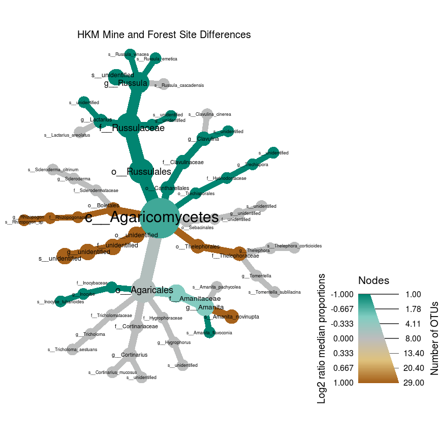

# Importing data and pre-processing


```r
library(phyloseq)
library(ggplot2)
library(tidyverse)
library(RColorBrewer)
library(cowplot)
library(metacoder)
library(dplyr)
library(vegan)
library(knitr)
library(kableExtra)
library(ggrepel)

all_data0 <- import_biom(BIOMfilename = "all_otu_table_mapping.tax.sample2.biom")
all_data0
```

```
## phyloseq-class experiment-level object
## otu_table()   OTU Table:         [ 2112 taxa and 282 samples ]
## sample_data() Sample Data:       [ 282 samples by 38 sample variables ]
## tax_table()   Taxonomy Table:    [ 2112 taxa by 7 taxonomic ranks ]
```

## Checking sequencing depth


```r
# Make a data frame with a column for the read counts of each sample
sample_sum_df <- data.frame(sum = sample_sums(all_data0))
# Histogram of sample read counts
ggplot(sample_sum_df, aes(x = sum)) + 
  geom_histogram(color = "black", fill = "indianred", binwidth = 2500) +
  ggtitle("Distribution of sample sequencing depth") + 
  xlab("Read counts") +
  theme_gray() + theme(axis.title.y = element_blank())
```

<!-- -->

## Standardizing by sequencing depth


```r
#Standardize abundances to the median sequencing depth
total <- median(sample_sums(all_data0))
standf <- function(x, t=total) round(t * (x/sum(x)))
all_data0.std <- transform_sample_counts(all_data0, standf)
#Filter taxa with cutoff 3.0 Coefficient of Variation
#BGM_data0.stdf <- filter_taxa(BGM_data0.std, function(x) sd(x)/mean(x) > 3.0, TRUE)
```

## Filtering "no hits"


```r
#Renaming taxonomy levels on tax_table
colnames(tax_table(all_data0.std)) <- c("Kingdom", "Phylum", "Class","Order", "Family", "Genus", "Species")
#Filtering no hit at Kingdom level
all_data <- subset_taxa(all_data0.std, Kingdom != "No blast hit")
```

# Taxa abudance at different rank levels


```r
#summarizing by tax rank
all.class <- tax_glom(all_data, "Class")
plot_bar(all.class, fill = "Class", x = "Mine") + theme_gray()
```

```
## Warning in psmelt(physeq): The sample variables: 
## Sample
##  have been renamed to: 
## sample_Sample
## to avoid conflicts with special phyloseq plot attribute names.
```


## Subsetting datasets by study

```r
#Silvehill dataset
SH_data <- subset_samples(all_data, grepl("SH", sample_data(all_data)$Mine))
SH_field <- subset_samples(SH_data, grepl("Field", sample_data(SH_data)$Collection))
SH_mine <- subset_samples(SH_field, grepl("Mine", sample_data(SH_field)$Treatment))

#BGM dataset
BGM_data <- subset_samples(all_data, grepl("BGM", sample_data(all_data)$Mine))
BGM_field <- subset_samples(BGM_data, grepl("Field", sample_data(BGM_data)$Collection))
BGM_mine <- subset_samples(BGM_field, grepl("Mine", sample_data(BGM_field)$Treatment))

#HKM dataset
HKM_data <- subset_samples(all_data, grepl("HKM", sample_data(all_data)$Mine))
HKM_field <- subset_samples(HKM_data, grepl("Field", sample_data(HKM_data)$Collection))
HKM_mine <- subset_samples(HKM_field, grepl("Mine", sample_data(HKM_field)$Treatment))

#RGM dataset
RGM_data <- subset_samples(all_data, grepl("RGM", sample_data(all_data)$Mine))

#Mines (four mines field data combined)
Mines_data <- subset_samples(all_data, grepl("Field", sample_data(all_data)$Collection))
```

## Different mines field samples analyzed together
## Relative abudance of genus and class in different mine soil and root samples


```r
TopNOTUs <- function(sample,N) {
  names(sort(taxa_sums(sample), TRUE)[1:N])
}
#Creating data frame from phyloseq object
top.Mines <- TopNOTUs(Mines_data, 100)
Mines.df <- prune_taxa(top.Mines, Mines_data) %>% psmelt()
#Sumarize data by site 
#test <- BGM.df %>% group_by(Genus) %>% summarise(sum(Abundance))
#plot by relative abundance
#Plot

pal <- colorRampPalette((brewer.pal(10, "Paired")))

## Genus plot root vs soil
Genus_soil <- ggplot(data = filter(Mines.df, Type == "Soil"), aes(Site, Abundance, fill = Genus)) +
  geom_bar(stat = "identity", position = position_fill()) + coord_flip() +
    scale_fill_manual(values = (rev(pal(24)))) + 
    guides(fill = guide_legend(reverse = TRUE, ncol = 1, keyheight = 0.8)) +
    facet_grid(~ Type, drop = TRUE) +
   theme(text = element_text(size = 15)) + theme_gray()

Genus_root <- ggplot(data = filter(Mines.df, Type == "Root"), aes(Site, Abundance, fill = Genus)) +
  geom_bar(stat = "identity", position = position_fill()) + coord_flip() +
    scale_fill_manual(values = rev(pal(24))) + 
    guides(fill = FALSE) +
    facet_grid(~ Type, drop = TRUE) +
   theme(text = element_text(size = 15)) + theme_gray()

plot_grid(Genus_root, Genus_soil, align = "h", rel_widths = c(1,1.4))
```


```r
## Class plot root vs soil
Class_soil <-ggplot(data = filter(Mines.df, Type == "Soil"), aes(Site, Abundance, fill = Class)) +
  geom_bar(stat = "identity", position = position_fill()) + coord_flip() +
  scale_fill_manual(values = (pal(24))) + 
  guides(fill = guide_legend(ncol = 1, keyheight = 0.8)) +
  facet_grid(~ Type, drop = TRUE) +
  theme(text = element_text(size = 15)) + theme_gray()

Class_root <-ggplot(data = filter(Mines.df, Type == "Root"), aes(Site, Abundance, fill = Class)) +
  geom_bar(stat = "identity", position = position_fill()) + coord_flip() +
  scale_fill_manual(values = (pal(24))) + 
  guides(fill = FALSE) +  
  facet_grid(~ Type, drop = TRUE) +
  theme(text = element_text(size = 15)) + theme_gray()

plot_grid(Class_root, Class_soil, align = "h", rel_widths = c(1,1.4))
```


```r
##Trying to stack the genus that belongs to the same class close to each other; also mannually set color so that the genus that belongs to the same class will be grouped in the same group of color

Mines.df$Genus <-  ordered(Mines.df$Genus, levels = c("g__unidentified", "g__Umbelopsis", "g__Mortierella","g__Meliniomyces", "g__Oidiodendron", "g__Elaphomyces", "g__Leptosphaeria", "g__Devriesia", "g__Cenococcum", "g__Archaeorhizomyces", "g__Thelephora",  "g__Russula", "g__Clavulina",  "g__Amphinema", "g__Scleroderma", "g__Rhizopogon", "g__Pisolithus", "g__Boletus", "g__Tricholoma", "g__Laccaria", "g__Cortinarius", "g__Amanita"))

Genus_soil <- ggplot(data = filter(Mines.df, Type == "Soil")) +
    geom_bar(aes(Site, Abundance, fill = Genus), stat = "identity", position = position_fill()) +
    coord_flip() +
    scale_fill_manual(values = rev(pal(24))) +
    guides(fill = guide_legend(reverse = TRUE, ncol = 1, keyheight = 0.8)) +
    facet_grid(~ Type, drop = TRUE) + 
    theme(text = element_text(size = 15)) + theme_gray()

Genus_root <- ggplot(data = filter(Mines.df, Type == "Root")) +
  geom_bar(aes(Site, Abundance, fill = Genus), stat = "identity", position = position_fill()) + coord_flip() +
    scale_fill_manual(values = rev(pal(24))) +
    #guides(fill = guide_legend(reverse = TRUE, ncol = 1, keyheight = 0.8)) +
    guides(fill = FALSE) +
    facet_grid(~ Type, drop = TRUE) + 
    theme(text = element_text(size = 15)) + theme_gray()

plot_grid(Genus_root, Genus_soil, align = "h", rel_widths = c(0.9,1.3))
```

<!-- -->

```r
#########I am carefully color coding each of the genus that appeared on the previous genus soil and root graph. Agaricales are blue, Boletales are green, and others... But it is very weird that not all genus that appeared on the previous graph appear on this graph.

### You pre-selecting the order of the genera, some your may be discarding some of the genera that appear on the previous graph

###Save in case
# Mines.df$Genus <-  ordered(Mines.df$Genus, levels = c("g__unidentified", "g__Umbelopsis", "g__Mortierella","g__Meliniomyces", "g__Oidiodendron", "g__Elaphomyces", "g__Leptosphaeria", "g__Devriesia", "g__Cenococcum", "g__Archaeorhizomyces", "g__Tricholoma","g__Thelephora", "g__Scleroderma", "g__Russula", "g__Rhizopogon","g__Pisolithus", "g__Laccaria", "g__Cortinarius", "g__Clavulina", "g__Boletus", "g__Amphinema", "g__Amanita"))
# Genus_soil <- ggplot(data = filter(Mines.df, Type == "Soil" & !is.na(Genus))) +
#   geom_bar(aes(Site, Abundance, fill = Genus), stat = "identity", position = position_fill()) + coord_flip() +
#     scale_fill_manual(values = c ("#969696", "#fed976", "#6a51a3", "#fd8d3c", "#d94801","#6baed6", "#2171b5", "#e5f5e0", "#c7e9c0", "#a1d99b", "#74c476", "#41ab5d", "#238b45", "#006d2c", "#00441b")) +
#     guides(fill = guide_legend(reverse = TRUE, ncol = 1, keyheight = 0.8)) +
#     facet_grid(~ Type, drop = TRUE) + 
#     theme(text = element_text(size = 15)) + theme_gray()
# 
# 
# Genus_soil
```

# Creating a table modeled after Huang et al. (2012)

A summary table representing the top OTUs across sample types and mine sites for this study based on the table present by [Huang at al. (2012)](https://link.springer.com/article/10.1007%2Fs00572-012-0436-0)

## BGM


```r
#Using BGM_mine dataset to extract top 25 OTUs on the mine sites
top25.BGM <- TopNOTUs(BGM_mine, 25) 

#Create a data frame to modify
top25.BGM.df <- psmelt(BGM_field)
```

```
## Warning in psmelt(BGM_field): The sample variables: 
## Sample
##  have been renamed to: 
## sample_Sample
## to avoid conflicts with special phyloseq plot attribute names.
```

```r
#Create data frame
test.df.BGM <-top25.BGM.df %>%
  group_by(Group, Type, Class, Family, Genus, OTU) %>% 
  summarise(Abd = sum(Abundance)) %>%
  unite(Group, Type, col="Sample", sep = "_") %>%
  unite(Class, Family, Genus, col = "Taxa", sep = ";") %>%
  spread(Sample, Abd)

#Percent
perc <- function (x) 100 * x/sum(x)
rnd <- function (x) round(x, 2)

#Table by sample
tbf.25.BGM <- test.df.BGM %>% 
  mutate_if(is.numeric, perc) %>%
  filter(OTU %in% top25.BGM) %>%
  mutate_if(is.numeric, rnd) %>%
  mutate(sumRow = rowSums(.[3:12])) %>%
  arrange(desc(sumRow))

kable(tbf.25.BGM[1:12], digits = 2, caption = "BGM", format = "markdown") 
```


|Taxa                                                     |OTU      | BGM_1_Root| BGM_1_Soil| BGM_2_Root| BGM_2_Soil| BGM_3_Root| BGM_3_Soil| BGM_4_Root| BGM_4_Soil| BGM_F_Root| BGM_F_Soil|
|:--------------------------------------------------------|:--------|----------:|----------:|----------:|----------:|----------:|----------:|----------:|----------:|----------:|----------:|
|c__Agaricomycetes;f__Pisolithaceae;g__Pisolithus         |OTU_137  |       0.00|       0.01|       0.03|       0.16|      31.05|       5.37|      12.88|       0.33|       0.00|       0.00|
|c__Dothideomycetes;f__Leptosphaeriaceae;g__Leptosphaeria |OTU_1417 |       0.05|       0.10|       0.02|       0.01|      44.18|       1.09|       0.14|       0.04|       0.00|       0.10|
|c__Dothideomycetes;f__Leptosphaeriaceae;g__Leptosphaeria |OTU_1361 |       0.01|       0.01|       0.00|       0.02|       0.00|       0.06|      27.38|       0.01|       0.00|       0.01|
|c__Dothideomycetes;f__Leptosphaeriaceae;g__Leptosphaeria |OTU_1416 |       5.05|       2.74|       2.69|       1.88|       3.68|       2.66|       3.09|       2.16|       0.28|       0.41|
|c__Agaricomycetes;f__unidentified;g__unidentified        |OTU_39   |      13.39|       4.13|       0.00|       0.00|       0.00|       0.00|       0.00|       0.00|       0.00|       0.00|
|c__Agaricomycetes;f__Rhizopogonaceae;g__Rhizopogon       |OTU_261  |       8.74|       2.50|       0.00|       0.89|       0.71|       0.01|       3.42|       0.98|       0.00|       0.00|
|c__Dothideomycetes;f__unidentified;g__unidentified       |OTU_1404 |      16.25|       0.06|       0.16|       0.01|       0.06|       0.20|       0.02|       0.02|       0.02|       0.07|
|c__Agaricomycetes;f__Boletaceae;g__Boletus               |OTU_128  |       0.00|       0.00|       0.00|       0.03|       0.00|       0.05|      13.18|       2.29|       0.00|       0.00|
|c__Dothideomycetes;f__unidentified;g__unidentified       |OTU_1428 |       0.72|       0.01|       0.05|       0.05|       0.02|      13.82|       0.06|       0.04|       0.05|       0.01|
|c__Dothideomycetes;f__unidentified;g__unidentified       |OTU_1442 |       0.02|       0.07|       0.49|       0.05|       0.01|       0.01|       0.14|      13.79|       0.07|       0.11|
|c__unidentified;f__unidentified;g__unidentified          |OTU_59   |       1.47|       0.28|       5.36|       2.61|       0.03|       0.00|       1.71|       3.05|       0.00|       0.00|
|c__Agaricomycetes;f__Thelephoraceae;g__unidentified      |OTU_185  |       3.90|       3.58|       4.83|       2.17|       0.00|       0.00|       0.00|       0.01|       0.00|       0.00|
|c__Dothideomycetes;f__Leptosphaeriaceae;g__Leptosphaeria |OTU_1450 |       0.01|       0.17|       0.01|       0.01|       0.01|       1.21|       2.02|       9.85|       0.02|       0.01|
|c__Dothideomycetes;f__unidentified;g__unidentified       |OTU_1406 |       1.36|       0.01|       0.00|       0.01|       0.00|      11.39|       0.28|       0.01|       0.00|       0.04|
|c__Dothideomycetes;f__Leptosphaeriaceae;g__Leptosphaeria |OTU_1435 |       0.05|       0.58|       0.01|       0.20|       0.00|       0.05|       0.15|      10.20|       0.00|       0.01|
|c__Dothideomycetes;f__unidentified;g__unidentified       |OTU_1448 |       0.03|      10.50|       0.01|       0.02|       0.05|       0.01|       0.46|       0.03|       0.08|       0.04|
|c__Dothideomycetes;f__Leptosphaeriaceae;g__Leptosphaeria |OTU_1371 |       0.04|       0.01|       0.01|       0.01|       0.00|      10.89|       0.09|       0.01|       0.00|       0.01|
|c__Dothideomycetes;f__Leptosphaeriaceae;g__Leptosphaeria |OTU_1427 |       0.10|       0.08|       0.02|       0.02|       0.04|      10.10|       0.03|       0.05|       0.12|       0.05|
|c__Dothideomycetes;f__Leptosphaeriaceae;g__Leptosphaeria |OTU_1213 |       0.76|       1.00|       0.55|       6.58|       0.34|       0.55|       0.25|       0.32|       0.04|       0.11|
|c__Dothideomycetes;f__unidentified;g__unidentified       |OTU_1429 |       0.01|       0.04|       0.10|       0.02|       0.00|       0.04|       0.00|      10.05|       0.03|       0.01|
|c__Dothideomycetes;f__unidentified;g__unidentified       |OTU_1459 |       0.00|       9.12|       0.01|       0.04|       0.00|       0.02|       0.00|       0.00|       0.00|       0.02|
|c__Dothideomycetes;f__Leptosphaeriaceae;g__Leptosphaeria |OTU_1426 |       0.23|       0.04|       0.03|       7.83|       0.01|       0.12|       0.05|       0.13|       0.00|       0.37|
|c__Dothideomycetes;f__Leptosphaeriaceae;g__Leptosphaeria |OTU_1382 |       0.26|       0.03|       0.01|       0.03|       0.11|       0.04|       0.77|       6.79|       0.59|       0.03|
|c__Dothideomycetes;f__unidentified;g__unidentified       |OTU_1390 |       0.03|       0.02|       0.09|       7.20|       0.09|       0.13|       0.05|       0.03|       0.12|       0.08|
|c__Dothideomycetes;f__Leptosphaeriaceae;g__Leptosphaeria |OTU_1405 |       0.01|       0.12|       0.05|       6.37|       0.01|       0.11|       0.03|       0.05|       0.00|       0.04|

```r
# top10.BGM.wsum <- merge(top10.BGM.df, sample_sum.std, by.x = "Sample", by.y = "Sample")
# top10.BGM.wsum$otu_rel_abd <- (top10.BGM.wsum$Abundance)/(top10.BGM.wsum$sum)*100
# top10.BGM.grouped <- group_by(top10.BGM.wsum, Genus, Type, Site)
# BGM.genus <- summarise(top10.BGM.grouped, relative_abundance = (sum(Abundance)/sum(sum))*100)
# View(BGM.genus)
```

## HKM


```r
# #Using HKM_mine dataset to extract top 10 OTUs on the mine sites
# top10.HKM <- TopNOTUs(HKM_mine, 10)
# #Then use HKM_field dataset to pull these taxa from both mine sites and forest site
# top10.HKM.df <- prune_taxa(top10.HKM, HKM_field) %>% psmelt()
# top10.HKM.wsum <- merge(top10.HKM.df, sample_sum.std, by.x = "Sample", by.y = "Sample")
# top10.HKM.wsum$otu_rel_abd <- (top10.HKM.wsum$Abundance)/(top10.HKM.wsum$sum)*100
# top10.HKM.grouped <- group_by(top10.HKM.wsum, Genus, Type, Site)
# HKM.genus <- summarise (top10.HKM.grouped, relative_abundance = (sum(Abundance)/sum(sum))*100)
# View (HKM.genus)

top25.HKM <- TopNOTUs(HKM_mine, 25) 

#Create a data frame to modify
top25.HKM.df <- psmelt(HKM_field)
```

```
## Warning in psmelt(HKM_field): The sample variables: 
## Sample
##  have been renamed to: 
## sample_Sample
## to avoid conflicts with special phyloseq plot attribute names.
```

```r
#Create data frame
test.df.HKM <-top25.HKM.df %>%
  group_by(Group, Type, Class, Family, Genus, OTU) %>% 
  summarise(Abd = sum(Abundance)) %>%
  unite(Group, Type, col="Sample", sep = "_") %>%
  unite(Class, Family, Genus, col = "Taxa", sep = ";") %>%
  spread(Sample, Abd)

#Percent
perc <- function (x) 100 * x/sum(x)
rnd <- function (x) round(x, 2)

#Table by sample
tbf.25.HKM <- test.df.HKM %>% 
  mutate_if(is.numeric, perc) %>%
  filter(OTU %in% top25.HKM) %>%
  mutate_if(is.numeric, rnd) %>%
  mutate(sumRow = rowSums(.[3:12])) %>%
  arrange(desc(sumRow))

kable(tbf.25.HKM[1:12], digits = 2, caption = "HKM", format = "markdown")
```


|Taxa                                                                  |OTU      | HKM_1_Root| HKM_1_Soil| HKM_2_Root| HKM_2_Soil| HKM_3_Root| HKM_3_Soil| HKM_4_Root| HKM_4_Soil| HKM_F_Root| HKM_F_Soil|
|:---------------------------------------------------------------------|:--------|----------:|----------:|----------:|----------:|----------:|----------:|----------:|----------:|----------:|----------:|
|c__Agaricomycetes;f__Amanitaceae;g__Amanita                           |OTU_35   |       1.30|      15.04|       0.00|       0.07|      20.66|      17.72|       0.39|       5.62|       0.01|       0.00|
|c__Leotiomycetes;f__Helotiaceae;g__Meliniomyces                       |OTU_28   |      18.91|       4.42|       5.40|       1.58|       9.13|       3.16|       5.51|       2.08|       5.89|       1.40|
|c__Leotiomycetes;f__Hyaloscyphaceae;g__unidentified                   |OTU_76   |      16.82|       2.20|       1.24|       0.24|       1.89|       1.31|      10.27|       0.20|       5.52|       2.45|
|c__Dothideomycetes;f__Gloniaceae;g__Cenococcum                        |OTU_26   |       0.21|       0.83|       0.03|       0.57|      31.41|       2.93|       1.08|       1.36|       0.32|       0.13|
|c__unidentified;f__unidentified;g__unidentified                       |OTU_58   |      24.56|       1.30|       0.00|       0.00|       0.00|       0.00|       4.20|       0.00|       0.00|       0.00|
|c__Agaricomycetes;f__unidentified;g__unidentified                     |OTU_63   |       9.58|      10.21|       0.00|       0.01|       0.00|       0.00|       4.65|       0.04|       0.00|       0.00|
|c__Leotiomycetes;f__Hyaloscyphaceae;g__unidentified                   |OTU_64   |       0.41|       0.05|       9.55|       2.13|       6.18|       2.06|       3.11|       0.71|       0.00|       0.16|
|c__Eurotiomycetes;f__unidentified;g__unidentified                     |OTU_34   |       0.10|       0.47|       7.40|       3.28|       1.44|       2.78|       3.54|       1.18|       1.72|       0.90|
|c__Leotiomycetes;f__Myxotrichaceae;g__Oidiodendron                    |OTU_89   |       0.18|       0.47|       4.40|       1.33|       2.00|       1.71|       8.99|       1.65|       0.29|       0.20|
|c__Agaricomycetes;f__Cortinariaceae;g__Cortinarius                    |OTU_24   |       0.00|       0.00|       0.01|       2.56|       0.02|      16.59|       0.00|       0.01|       0.00|       0.00|
|c__Mortierellomycetes;f__Mortierellaceae;g__Mortierella               |OTU_60   |       0.14|       4.70|       0.03|       6.18|       0.01|       0.02|       0.00|       0.00|       0.08|       1.52|
|c__Agaricomycetes;f__unidentified;g__unidentified                     |OTU_46   |       0.00|       0.00|       6.85|       3.87|       0.01|       0.00|       0.00|       0.00|       0.00|       0.00|
|c__Leotiomycetes;f__Myxotrichaceae;g__Oidiodendron                    |OTU_91   |       0.03|       0.44|       0.53|       2.32|       0.43|       1.82|       2.22|       1.37|       0.02|       0.21|
|c__Agaricomycetes;f__Clavulinaceae;g__Clavulina                       |OTU_65   |       0.00|       0.00|       0.65|       8.05|       0.01|       0.00|       0.00|       0.00|       0.00|       0.00|
|c__Mortierellomycetes;f__Mortierellaceae;g__Mortierella               |OTU_61   |       0.00|       1.06|       0.05|       6.65|       0.01|       0.00|       0.40|       0.13|       0.00|       0.00|
|c__Agaricomycetes;f__Russulaceae;g__Russula                           |OTU_106  |       0.00|       0.00|       3.42|       4.24|       0.00|       0.48|       0.00|       0.05|       0.00|       0.00|
|c__Umbelopsidomycetes;f__Umbelopsidaceae;g__Umbelopsis                |OTU_29   |       0.00|       0.00|       0.17|       5.80|       0.00|       0.30|       0.09|       0.34|       0.01|       1.21|
|c__Mortierellomycetes;f__Mortierellaceae;g__Mortierella               |OTU_27   |       0.16|       3.46|       0.06|       1.27|       0.01|       2.42|       0.09|       0.01|       0.05|       0.25|
|c__Dothideomycetes;f__unidentified;g__unidentified                    |OTU_1463 |       0.04|       6.70|       0.01|       0.02|       0.20|       0.01|       0.06|       0.01|       0.55|       0.01|
|c__Dothideomycetes;f__unidentified;g__unidentified                    |OTU_1443 |       0.24|       0.02|       0.03|       0.00|       0.66|       5.36|       0.00|       0.01|       0.61|       0.00|
|c__Archaeorhizomycetes;f__Archaeorhizomycetaceae;g__Archaeorhizomyces |OTU_36   |       0.00|       1.67|       0.01|       3.70|       0.01|       0.36|       0.00|       0.95|       0.00|       0.00|
|c__Dothideomycetes;f__unidentified;g__unidentified                    |OTU_1444 |       0.00|       0.00|       0.00|       0.00|       0.00|       0.01|       0.03|       6.30|       0.20|       0.00|
|c__Dothideomycetes;f__Leptosphaeriaceae;g__Leptosphaeria              |OTU_1358 |       0.19|       0.02|       0.85|       0.05|       0.04|       0.05|       0.00|       4.79|       0.10|       0.02|
|c__Dothideomycetes;f__unidentified;g__unidentified                    |OTU_1511 |       0.01|       0.00|       0.00|       0.00|       0.04|       0.00|       0.00|       4.99|       0.00|       0.01|
|c__Agaricomycetes;f__unidentified;g__unidentified                     |OTU_39   |       0.00|       0.00|       0.01|       4.61|       0.00|       0.00|       0.00|       0.01|       0.00|       0.00|

## SH


```r
# #Using BGM_mine dataset to extract top 10 OTUs on the mine sites
# top10.SH <- TopNOTUs(SH_mine, 10)
# #Then use BGM_field dataset to pull these taxa from both mine sites and forest site
# top10.SH.df <- prune_taxa(top10.SH, SH_field) %>% psmelt()
# top10.SH.wsum <- merge(top10.SH.df, sample_sum.std, by.x = "Sample", by.y = "Sample")
# top10.SH.wsum$otu_rel_abd <- (top10.SH.wsum$Abundance)/(top10.SH.wsum$sum)*100
# top10.SH.grouped <- group_by(top10.SH.wsum, Genus, Type, Site)
# SH.genus <- summarise (top10.SH.grouped, relative_abundance = (sum(Abundance)/sum(sum))*100)
# View (SH.genus)

top25.SH <- TopNOTUs(SH_mine, 25) 

#Create a data frame to modify
top25.SH.df <- psmelt(SH_field)
```

```
## Warning in psmelt(SH_field): The sample variables: 
## Sample
##  have been renamed to: 
## sample_Sample
## to avoid conflicts with special phyloseq plot attribute names.
```

```r
#Create data frame
test.df.SH <-top25.SH.df %>%
  group_by(Group, Type, Class, Family, Genus, OTU) %>% 
  summarise(Abd = sum(Abundance)) %>%
  unite(Group, Type, col="Sample", sep = "_") %>%
  unite(Class, Family, Genus, col = "Taxa", sep = ";") %>%
  spread(Sample, Abd)

#Percent
perc <- function (x) 100 * x/sum(x)
rnd <- function (x) round(x, 2)

#Table by sample
tbf.25.SH <- test.df.SH %>% 
  mutate_if(is.numeric, perc) %>%
  filter(OTU %in% top25.SH) %>%
  mutate_if(is.numeric, rnd) %>%
  mutate(sumRow = rowSums(.[3:5])) %>%
  arrange(desc(sumRow))

kable(tbf.25.SH[1:5], digits = 2, caption = "SH", format = "markdown")
```


|Taxa                                                     |OTU      | SH_F_Soil| SH_M_Soil| SH_P_Soil|
|:--------------------------------------------------------|:--------|---------:|---------:|---------:|
|c__Agaricomycetes;f__Sclerodermataceae;g__Scleroderma    |OTU_108  |         0|      0.00|     47.19|
|c__unidentified;f__unidentified;g__unidentified          |OTU_21   |         0|      8.79|      0.40|
|c__Rhizophydiomycetes;f__unidentified;g__unidentified    |OTU_38   |         0|      7.42|      0.36|
|c__unidentified;f__unidentified;g__unidentified          |OTU_33   |         0|      0.00|      7.27|
|c__Dothideomycetes;f__Teratosphaeriaceae;g__Devriesia    |OTU_52   |         0|      6.77|      0.20|
|c__unidentified;f__unidentified;g__unidentified          |OTU_25   |         0|      5.65|      0.00|
|c__unidentified;f__unidentified;g__unidentified          |OTU_75   |         0|      5.34|      0.09|
|c__unidentified;f__unidentified;g__unidentified          |OTU_23   |         0|      5.37|      0.00|
|c__unidentified;f__unidentified;g__unidentified          |OTU_30   |         0|      3.88|      0.00|
|c__Dothideomycetes;f__Leptosphaeriaceae;g__Leptosphaeria |OTU_1488 |         0|      2.71|      0.00|
|c__Dothideomycetes;f__Leptosphaeriaceae;g__Leptosphaeria |OTU_1487 |         0|      2.40|      0.00|
|c__Dothideomycetes;f__Leptosphaeriaceae;g__Leptosphaeria |OTU_1525 |         0|      2.40|      0.00|
|c__Dothideomycetes;f__Leptosphaeriaceae;g__Leptosphaeria |OTU_1495 |         0|      2.15|      0.00|
|c__unidentified;f__unidentified;g__unidentified          |OTU_59   |         0|      2.14|      0.00|
|c__Dothideomycetes;f__Didymellaceae;g__Phoma             |OTU_182  |         0|      2.12|      0.01|
|c__Eurotiomycetes;f__Aspergillaceae;g__Aspergillus       |OTU_435  |         0|      2.11|      0.00|
|c__Dothideomycetes;f__Leptosphaeriaceae;g__Leptosphaeria |OTU_1483 |         0|      2.10|      0.00|
|c__Lecanoromycetes;f__Parmeliaceae;g__Protoparmelia      |OTU_776  |         0|      2.05|      0.01|
|c__unidentified;f__unidentified;g__unidentified          |OTU_528  |         0|      1.99|      0.00|
|c__Eurotiomycetes;f__unidentified;g__unidentified        |OTU_372  |         0|      1.84|      0.01|
|c__Dothideomycetes;f__Leptosphaeriaceae;g__Leptosphaeria |OTU_1285 |         0|      1.81|      0.00|
|c__unidentified;f__unidentified;g__unidentified          |OTU_116  |         0|      1.73|      0.03|
|c__Dothideomycetes;f__Leptosphaeriaceae;g__Leptosphaeria |OTU_1269 |         0|      1.75|      0.00|
|c__unidentified;f__unidentified;g__unidentified          |OTU_422  |         0|      1.70|      0.01|
|c__Dothideomycetes;f__unidentified;g__unidentified       |OTU_1397 |         0|      1.55|      0.00|

## RGM


```r
#RGM_data dataset is used here to extract top 10 OTUs on the mine sites because all RGM samples came from mine sites
# top10.RGM <- TopNOTUs(RGM_data, 10)
# #Then use BGM_field dataset to pull these taxa from both mine sites and forest site
# top10.RGM.df <- prune_taxa(top10.RGM, RGM_data) %>% psmelt()
# top10.RGM.wsum <- merge(top10.RGM.df, sample_sum.std, by.x = "Sample", by.y = "Sample")
# top10.RGM.wsum$otu_rel_abd <- (top10.RGM.wsum$Abundance)/(top10.RGM.wsum$sum)*100
# top10.RGM.grouped <- group_by(top10.RGM.wsum, Genus, Type, Site)
# RGM.genus <- summarise (top10.RGM.grouped, relative_abundance = (sum(Abundance)/sum(sum))*100)
# View (RGM.genus)

top25.RGM <- TopNOTUs(RGM_data, 25) 

#Create a data frame to modify
top25.RGM.df <- psmelt(RGM_data)
```

```
## Warning in psmelt(RGM_data): The sample variables: 
## Sample
##  have been renamed to: 
## sample_Sample
## to avoid conflicts with special phyloseq plot attribute names.
```

```r
#Create data frame
test.df.RGM <-top25.RGM.df %>%
  group_by(Group, Type, Class, Family, Genus, OTU) %>% 
  summarise(Abd = sum(Abundance)) %>%
  unite(Group, Type, col="Sample", sep = "_") %>%
  unite(Class, Family, Genus, col = "Taxa", sep = ";") %>%
  spread(Sample, Abd)

#Percent
perc <- function (x) 100 * x/sum(x)
rnd <- function (x) round(x, 2)

#Table by sample
tbf.25.RGM <- test.df.RGM %>% 
  mutate_if(is.numeric, perc) %>%
  filter(OTU %in% top25.RGM) %>%
  mutate_if(is.numeric, rnd) %>%
  mutate(sumRow = rowSums(.[3:6])) %>%
  arrange(desc(sumRow))

kable(tbf.25.RGM[1:6], digits = 2, caption = "RGM", format = "markdown")
```


|Taxa                                                                  |OTU      | RGM_Pit_Root| RGM_Pit_Soil| RGM_Process_Root| RGM_Process_Soil|
|:---------------------------------------------------------------------|:--------|------------:|------------:|----------------:|----------------:|
|c__Dothideomycetes;f__Leptosphaeriaceae;g__Leptosphaeria              |OTU_1368 |         0.02|         0.04|            26.89|             0.01|
|c__Dothideomycetes;f__Leptosphaeriaceae;g__Leptosphaeria              |OTU_1483 |        24.38|         0.02|             0.00|             0.00|
|c__Mortierellomycetes;f__Mortierellaceae;g__Mortierella               |OTU_27   |         0.66|         6.39|             0.18|            15.47|
|c__Agaricomycetes;f__Russulaceae;g__Russula                           |OTU_409  |         0.10|        10.28|             0.00|            10.95|
|c__Leotiomycetes;f__Vibrisseaceae;g__Phialocephala                    |OTU_687  |        10.20|         0.45|             8.67|             0.04|
|c__Dothideomycetes;f__unidentified;g__unidentified                    |OTU_1454 |        16.00|         0.01|             0.00|             0.00|
|c__Dothideomycetes;f__unidentified;g__unidentified                    |OTU_1505 |         0.01|        13.39|             0.18|             0.18|
|c__Agaricomycetes;f__Russulaceae;g__Russula                           |OTU_100  |         0.00|        12.34|             0.00|             0.00|
|c__Agaricomycetes;f__Hygrophoraceae;g__Hygrocybe                      |OTU_105  |         0.00|         1.50|             0.00|            10.78|
|c__Leotiomycetes;f__Hyaloscyphaceae;g__unidentified                   |OTU_94   |        10.34|         0.00|             0.01|             0.00|
|c__unidentified;f__unidentified;g__unidentified                       |OTU_37   |         0.01|         0.28|             0.01|            10.01|
|c__Rozellomycotina_cls_Incertae_sedis;f__unidentified;g__unidentified |OTU_133  |         0.00|         0.00|             9.65|             0.22|
|c__Leotiomycetes;f__Helotiales_fam_Incertae_sedis;g__Leptodontidium   |OTU_300  |         5.85|         0.82|             2.69|             0.03|
|c__Agaricomycetes;f__Exidiaceae;g__unidentified                       |OTU_394  |         3.13|         0.00|             6.08|             0.05|
|c__Leotiomycetes;f__unidentified;g__unidentified                      |OTU_183  |         5.13|         0.09|             2.08|             0.00|
|c__Leotiomycetes;f__Myxotrichaceae;g__Oidiodendron                    |OTU_284  |         3.51|         0.08|             2.81|             0.03|
|c__Agaricomycetes;f__Hydnodontaceae;g__Trechispora                    |OTU_202  |         0.00|         0.45|             5.29|             0.03|
|c__Archaeorhizomycetes;f__Archaeorhizomycetaceae;g__Archaeorhizomyces |OTU_36   |         1.54|         3.16|             0.00|             0.00|
|c__Agaricomycetes;f__Inocybaceae;g__Inocybe                           |OTU_304  |         0.00|         0.00|             0.00|             4.67|
|c__Dothideomycetes;f__Leptosphaeriaceae;g__Leptosphaeria              |OTU_1527 |         0.00|         0.06|             0.00|             4.23|
|c__Mortierellomycetes;f__Mortierellaceae;g__Mortierella               |OTU_1122 |         0.00|         0.48|             0.00|             3.58|
|c__Agaricomycetes;f__unidentified;g__unidentified                     |OTU_473  |         0.00|         3.86|             0.00|             0.00|
|c__Agaricomycetes;f__Russulaceae;g__unidentified                      |OTU_155  |         0.01|         3.40|             0.00|             0.00|
|c__Dothideomycetes;f__Leptosphaeriaceae;g__Leptosphaeria              |OTU_1455 |         0.00|         3.24|             0.13|             0.01|
|c__Umbelopsidomycetes;f__Umbelopsidaceae;g__Umbelopsis                |OTU_29   |         0.00|         1.55|             0.01|             1.58|

## Put the tables together

```r
# All.genus <- rbind (BGM.genus, HKM.genus, SH.genus, RGM.genus)
# View (All.genus)
# unique_genus <- unique (All.genus$Genus)
# All.genus.table <- data.frame ("Genus" = unique_genus)
# All.genus.soil <- filter(All.genus, Type == "Soil")
# All.genus.root <- filter(All.genus, Type == "Root")
# list_site <- unique (All.genus$Site)
# All.genus$BGM_1_soil <- NA

final_tbf <- full_join(tbf.25.BGM[1:12],tbf.25.HKM[1:12], by=c("Taxa","OTU")) %>%
  full_join(tbf.25.SH[1:5], by=c("Taxa","OTU")) %>%
  full_join(tbf.25.RGM[1:6], by=c("Taxa","OTU"))

final_tbf[is.na(final_tbf)] <- ""

kable(final_tbf, digits = 2, caption = "Final Table top 25 OTUs", format = "markdown")
```


|Taxa                                                                  |OTU      |BGM_1_Root |BGM_1_Soil |BGM_2_Root |BGM_2_Soil |BGM_3_Root |BGM_3_Soil |BGM_4_Root |BGM_4_Soil |BGM_F_Root |BGM_F_Soil |HKM_1_Root |HKM_1_Soil |HKM_2_Root |HKM_2_Soil |HKM_3_Root |HKM_3_Soil |HKM_4_Root |HKM_4_Soil |HKM_F_Root |HKM_F_Soil |SH_F_Soil |SH_M_Soil |SH_P_Soil |RGM_Pit_Root |RGM_Pit_Soil |RGM_Process_Root |RGM_Process_Soil |
|:---------------------------------------------------------------------|:--------|:----------|:----------|:----------|:----------|:----------|:----------|:----------|:----------|:----------|:----------|:----------|:----------|:----------|:----------|:----------|:----------|:----------|:----------|:----------|:----------|:---------|:---------|:---------|:------------|:------------|:----------------|:----------------|
|c__Agaricomycetes;f__Pisolithaceae;g__Pisolithus                      |OTU_137  |0          |0.01       |0.03       |0.16       |31.05      |5.37       |12.88      |0.33       |0          |0          |           |           |           |           |           |           |           |           |           |           |          |          |          |             |             |                 |                 |
|c__Dothideomycetes;f__Leptosphaeriaceae;g__Leptosphaeria              |OTU_1417 |0.05       |0.1        |0.02       |0.01       |44.18      |1.09       |0.14       |0.04       |0          |0.1        |           |           |           |           |           |           |           |           |           |           |          |          |          |             |             |                 |                 |
|c__Dothideomycetes;f__Leptosphaeriaceae;g__Leptosphaeria              |OTU_1361 |0.01       |0.01       |0          |0.02       |0          |0.06       |27.38      |0.01       |0          |0.01       |           |           |           |           |           |           |           |           |           |           |          |          |          |             |             |                 |                 |
|c__Dothideomycetes;f__Leptosphaeriaceae;g__Leptosphaeria              |OTU_1416 |5.05       |2.74       |2.69       |1.88       |3.68       |2.66       |3.09       |2.16       |0.28       |0.41       |           |           |           |           |           |           |           |           |           |           |          |          |          |             |             |                 |                 |
|c__Agaricomycetes;f__unidentified;g__unidentified                     |OTU_39   |13.39      |4.13       |0          |0          |0          |0          |0          |0          |0          |0          |0          |0          |0.01       |4.61       |0          |0          |0          |0.01       |0          |0          |          |          |          |             |             |                 |                 |
|c__Agaricomycetes;f__Rhizopogonaceae;g__Rhizopogon                    |OTU_261  |8.74       |2.5        |0          |0.89       |0.71       |0.01       |3.42       |0.98       |0          |0          |           |           |           |           |           |           |           |           |           |           |          |          |          |             |             |                 |                 |
|c__Dothideomycetes;f__unidentified;g__unidentified                    |OTU_1404 |16.25      |0.06       |0.16       |0.01       |0.06       |0.2        |0.02       |0.02       |0.02       |0.07       |           |           |           |           |           |           |           |           |           |           |          |          |          |             |             |                 |                 |
|c__Agaricomycetes;f__Boletaceae;g__Boletus                            |OTU_128  |0          |0          |0          |0.03       |0          |0.05       |13.18      |2.29       |0          |0          |           |           |           |           |           |           |           |           |           |           |          |          |          |             |             |                 |                 |
|c__Dothideomycetes;f__unidentified;g__unidentified                    |OTU_1428 |0.72       |0.01       |0.05       |0.05       |0.02       |13.82      |0.06       |0.04       |0.05       |0.01       |           |           |           |           |           |           |           |           |           |           |          |          |          |             |             |                 |                 |
|c__Dothideomycetes;f__unidentified;g__unidentified                    |OTU_1442 |0.02       |0.07       |0.49       |0.05       |0.01       |0.01       |0.14       |13.79      |0.07       |0.11       |           |           |           |           |           |           |           |           |           |           |          |          |          |             |             |                 |                 |
|c__unidentified;f__unidentified;g__unidentified                       |OTU_59   |1.47       |0.28       |5.36       |2.61       |0.03       |0          |1.71       |3.05       |0          |0          |           |           |           |           |           |           |           |           |           |           |0         |2.14      |0         |             |             |                 |                 |
|c__Agaricomycetes;f__Thelephoraceae;g__unidentified                   |OTU_185  |3.9        |3.58       |4.83       |2.17       |0          |0          |0          |0.01       |0          |0          |           |           |           |           |           |           |           |           |           |           |          |          |          |             |             |                 |                 |
|c__Dothideomycetes;f__Leptosphaeriaceae;g__Leptosphaeria              |OTU_1450 |0.01       |0.17       |0.01       |0.01       |0.01       |1.21       |2.02       |9.85       |0.02       |0.01       |           |           |           |           |           |           |           |           |           |           |          |          |          |             |             |                 |                 |
|c__Dothideomycetes;f__unidentified;g__unidentified                    |OTU_1406 |1.36       |0.01       |0          |0.01       |0          |11.39      |0.28       |0.01       |0          |0.04       |           |           |           |           |           |           |           |           |           |           |          |          |          |             |             |                 |                 |
|c__Dothideomycetes;f__Leptosphaeriaceae;g__Leptosphaeria              |OTU_1435 |0.05       |0.58       |0.01       |0.2        |0          |0.05       |0.15       |10.2       |0          |0.01       |           |           |           |           |           |           |           |           |           |           |          |          |          |             |             |                 |                 |
|c__Dothideomycetes;f__unidentified;g__unidentified                    |OTU_1448 |0.03       |10.5       |0.01       |0.02       |0.05       |0.01       |0.46       |0.03       |0.08       |0.04       |           |           |           |           |           |           |           |           |           |           |          |          |          |             |             |                 |                 |
|c__Dothideomycetes;f__Leptosphaeriaceae;g__Leptosphaeria              |OTU_1371 |0.04       |0.01       |0.01       |0.01       |0          |10.89      |0.09       |0.01       |0          |0.01       |           |           |           |           |           |           |           |           |           |           |          |          |          |             |             |                 |                 |
|c__Dothideomycetes;f__Leptosphaeriaceae;g__Leptosphaeria              |OTU_1427 |0.1        |0.08       |0.02       |0.02       |0.04       |10.1       |0.03       |0.05       |0.12       |0.05       |           |           |           |           |           |           |           |           |           |           |          |          |          |             |             |                 |                 |
|c__Dothideomycetes;f__Leptosphaeriaceae;g__Leptosphaeria              |OTU_1213 |0.76       |1          |0.55       |6.58       |0.34       |0.55       |0.25       |0.32       |0.04       |0.11       |           |           |           |           |           |           |           |           |           |           |          |          |          |             |             |                 |                 |
|c__Dothideomycetes;f__unidentified;g__unidentified                    |OTU_1429 |0.01       |0.04       |0.1        |0.02       |0          |0.04       |0          |10.05      |0.03       |0.01       |           |           |           |           |           |           |           |           |           |           |          |          |          |             |             |                 |                 |
|c__Dothideomycetes;f__unidentified;g__unidentified                    |OTU_1459 |0          |9.12       |0.01       |0.04       |0          |0.02       |0          |0          |0          |0.02       |           |           |           |           |           |           |           |           |           |           |          |          |          |             |             |                 |                 |
|c__Dothideomycetes;f__Leptosphaeriaceae;g__Leptosphaeria              |OTU_1426 |0.23       |0.04       |0.03       |7.83       |0.01       |0.12       |0.05       |0.13       |0          |0.37       |           |           |           |           |           |           |           |           |           |           |          |          |          |             |             |                 |                 |
|c__Dothideomycetes;f__Leptosphaeriaceae;g__Leptosphaeria              |OTU_1382 |0.26       |0.03       |0.01       |0.03       |0.11       |0.04       |0.77       |6.79       |0.59       |0.03       |           |           |           |           |           |           |           |           |           |           |          |          |          |             |             |                 |                 |
|c__Dothideomycetes;f__unidentified;g__unidentified                    |OTU_1390 |0.03       |0.02       |0.09       |7.2        |0.09       |0.13       |0.05       |0.03       |0.12       |0.08       |           |           |           |           |           |           |           |           |           |           |          |          |          |             |             |                 |                 |
|c__Dothideomycetes;f__Leptosphaeriaceae;g__Leptosphaeria              |OTU_1405 |0.01       |0.12       |0.05       |6.37       |0.01       |0.11       |0.03       |0.05       |0          |0.04       |           |           |           |           |           |           |           |           |           |           |          |          |          |             |             |                 |                 |
|c__Agaricomycetes;f__Amanitaceae;g__Amanita                           |OTU_35   |           |           |           |           |           |           |           |           |           |           |1.3        |15.04      |0          |0.07       |20.66      |17.72      |0.39       |5.62       |0.01       |0          |          |          |          |             |             |                 |                 |
|c__Leotiomycetes;f__Helotiaceae;g__Meliniomyces                       |OTU_28   |           |           |           |           |           |           |           |           |           |           |18.91      |4.42       |5.4        |1.58       |9.13       |3.16       |5.51       |2.08       |5.89       |1.4        |          |          |          |             |             |                 |                 |
|c__Leotiomycetes;f__Hyaloscyphaceae;g__unidentified                   |OTU_76   |           |           |           |           |           |           |           |           |           |           |16.82      |2.2        |1.24       |0.24       |1.89       |1.31       |10.27      |0.2        |5.52       |2.45       |          |          |          |             |             |                 |                 |
|c__Dothideomycetes;f__Gloniaceae;g__Cenococcum                        |OTU_26   |           |           |           |           |           |           |           |           |           |           |0.21       |0.83       |0.03       |0.57       |31.41      |2.93       |1.08       |1.36       |0.32       |0.13       |          |          |          |             |             |                 |                 |
|c__unidentified;f__unidentified;g__unidentified                       |OTU_58   |           |           |           |           |           |           |           |           |           |           |24.56      |1.3        |0          |0          |0          |0          |4.2        |0          |0          |0          |          |          |          |             |             |                 |                 |
|c__Agaricomycetes;f__unidentified;g__unidentified                     |OTU_63   |           |           |           |           |           |           |           |           |           |           |9.58       |10.21      |0          |0.01       |0          |0          |4.65       |0.04       |0          |0          |          |          |          |             |             |                 |                 |
|c__Leotiomycetes;f__Hyaloscyphaceae;g__unidentified                   |OTU_64   |           |           |           |           |           |           |           |           |           |           |0.41       |0.05       |9.55       |2.13       |6.18       |2.06       |3.11       |0.71       |0          |0.16       |          |          |          |             |             |                 |                 |
|c__Eurotiomycetes;f__unidentified;g__unidentified                     |OTU_34   |           |           |           |           |           |           |           |           |           |           |0.1        |0.47       |7.4        |3.28       |1.44       |2.78       |3.54       |1.18       |1.72       |0.9        |          |          |          |             |             |                 |                 |
|c__Leotiomycetes;f__Myxotrichaceae;g__Oidiodendron                    |OTU_89   |           |           |           |           |           |           |           |           |           |           |0.18       |0.47       |4.4        |1.33       |2          |1.71       |8.99       |1.65       |0.29       |0.2        |          |          |          |             |             |                 |                 |
|c__Agaricomycetes;f__Cortinariaceae;g__Cortinarius                    |OTU_24   |           |           |           |           |           |           |           |           |           |           |0          |0          |0.01       |2.56       |0.02       |16.59      |0          |0.01       |0          |0          |          |          |          |             |             |                 |                 |
|c__Mortierellomycetes;f__Mortierellaceae;g__Mortierella               |OTU_60   |           |           |           |           |           |           |           |           |           |           |0.14       |4.7        |0.03       |6.18       |0.01       |0.02       |0          |0          |0.08       |1.52       |          |          |          |             |             |                 |                 |
|c__Agaricomycetes;f__unidentified;g__unidentified                     |OTU_46   |           |           |           |           |           |           |           |           |           |           |0          |0          |6.85       |3.87       |0.01       |0          |0          |0          |0          |0          |          |          |          |             |             |                 |                 |
|c__Leotiomycetes;f__Myxotrichaceae;g__Oidiodendron                    |OTU_91   |           |           |           |           |           |           |           |           |           |           |0.03       |0.44       |0.53       |2.32       |0.43       |1.82       |2.22       |1.37       |0.02       |0.21       |          |          |          |             |             |                 |                 |
|c__Agaricomycetes;f__Clavulinaceae;g__Clavulina                       |OTU_65   |           |           |           |           |           |           |           |           |           |           |0          |0          |0.65       |8.05       |0.01       |0          |0          |0          |0          |0          |          |          |          |             |             |                 |                 |
|c__Mortierellomycetes;f__Mortierellaceae;g__Mortierella               |OTU_61   |           |           |           |           |           |           |           |           |           |           |0          |1.06       |0.05       |6.65       |0.01       |0          |0.4        |0.13       |0          |0          |          |          |          |             |             |                 |                 |
|c__Agaricomycetes;f__Russulaceae;g__Russula                           |OTU_106  |           |           |           |           |           |           |           |           |           |           |0          |0          |3.42       |4.24       |0          |0.48       |0          |0.05       |0          |0          |          |          |          |             |             |                 |                 |
|c__Umbelopsidomycetes;f__Umbelopsidaceae;g__Umbelopsis                |OTU_29   |           |           |           |           |           |           |           |           |           |           |0          |0          |0.17       |5.8        |0          |0.3        |0.09       |0.34       |0.01       |1.21       |          |          |          |0            |1.55         |0.01             |1.58             |
|c__Mortierellomycetes;f__Mortierellaceae;g__Mortierella               |OTU_27   |           |           |           |           |           |           |           |           |           |           |0.16       |3.46       |0.06       |1.27       |0.01       |2.42       |0.09       |0.01       |0.05       |0.25       |          |          |          |0.66         |6.39         |0.18             |15.47            |
|c__Dothideomycetes;f__unidentified;g__unidentified                    |OTU_1463 |           |           |           |           |           |           |           |           |           |           |0.04       |6.7        |0.01       |0.02       |0.2        |0.01       |0.06       |0.01       |0.55       |0.01       |          |          |          |             |             |                 |                 |
|c__Dothideomycetes;f__unidentified;g__unidentified                    |OTU_1443 |           |           |           |           |           |           |           |           |           |           |0.24       |0.02       |0.03       |0          |0.66       |5.36       |0          |0.01       |0.61       |0          |          |          |          |             |             |                 |                 |
|c__Archaeorhizomycetes;f__Archaeorhizomycetaceae;g__Archaeorhizomyces |OTU_36   |           |           |           |           |           |           |           |           |           |           |0          |1.67       |0.01       |3.7        |0.01       |0.36       |0          |0.95       |0          |0          |          |          |          |1.54         |3.16         |0                |0                |
|c__Dothideomycetes;f__unidentified;g__unidentified                    |OTU_1444 |           |           |           |           |           |           |           |           |           |           |0          |0          |0          |0          |0          |0.01       |0.03       |6.3        |0.2        |0          |          |          |          |             |             |                 |                 |
|c__Dothideomycetes;f__Leptosphaeriaceae;g__Leptosphaeria              |OTU_1358 |           |           |           |           |           |           |           |           |           |           |0.19       |0.02       |0.85       |0.05       |0.04       |0.05       |0          |4.79       |0.1        |0.02       |          |          |          |             |             |                 |                 |
|c__Dothideomycetes;f__unidentified;g__unidentified                    |OTU_1511 |           |           |           |           |           |           |           |           |           |           |0.01       |0          |0          |0          |0.04       |0          |0          |4.99       |0          |0.01       |          |          |          |             |             |                 |                 |
|c__Agaricomycetes;f__Sclerodermataceae;g__Scleroderma                 |OTU_108  |           |           |           |           |           |           |           |           |           |           |           |           |           |           |           |           |           |           |           |           |0         |0         |47.19     |             |             |                 |                 |
|c__unidentified;f__unidentified;g__unidentified                       |OTU_21   |           |           |           |           |           |           |           |           |           |           |           |           |           |           |           |           |           |           |           |           |0         |8.79      |0.4       |             |             |                 |                 |
|c__Rhizophydiomycetes;f__unidentified;g__unidentified                 |OTU_38   |           |           |           |           |           |           |           |           |           |           |           |           |           |           |           |           |           |           |           |           |0         |7.42      |0.36      |             |             |                 |                 |
|c__unidentified;f__unidentified;g__unidentified                       |OTU_33   |           |           |           |           |           |           |           |           |           |           |           |           |           |           |           |           |           |           |           |           |0         |0         |7.27      |             |             |                 |                 |
|c__Dothideomycetes;f__Teratosphaeriaceae;g__Devriesia                 |OTU_52   |           |           |           |           |           |           |           |           |           |           |           |           |           |           |           |           |           |           |           |           |0         |6.77      |0.2       |             |             |                 |                 |
|c__unidentified;f__unidentified;g__unidentified                       |OTU_25   |           |           |           |           |           |           |           |           |           |           |           |           |           |           |           |           |           |           |           |           |0         |5.65      |0         |             |             |                 |                 |
|c__unidentified;f__unidentified;g__unidentified                       |OTU_75   |           |           |           |           |           |           |           |           |           |           |           |           |           |           |           |           |           |           |           |           |0         |5.34      |0.09      |             |             |                 |                 |
|c__unidentified;f__unidentified;g__unidentified                       |OTU_23   |           |           |           |           |           |           |           |           |           |           |           |           |           |           |           |           |           |           |           |           |0         |5.37      |0         |             |             |                 |                 |
|c__unidentified;f__unidentified;g__unidentified                       |OTU_30   |           |           |           |           |           |           |           |           |           |           |           |           |           |           |           |           |           |           |           |           |0         |3.88      |0         |             |             |                 |                 |
|c__Dothideomycetes;f__Leptosphaeriaceae;g__Leptosphaeria              |OTU_1488 |           |           |           |           |           |           |           |           |           |           |           |           |           |           |           |           |           |           |           |           |0         |2.71      |0         |             |             |                 |                 |
|c__Dothideomycetes;f__Leptosphaeriaceae;g__Leptosphaeria              |OTU_1487 |           |           |           |           |           |           |           |           |           |           |           |           |           |           |           |           |           |           |           |           |0         |2.4       |0         |             |             |                 |                 |
|c__Dothideomycetes;f__Leptosphaeriaceae;g__Leptosphaeria              |OTU_1525 |           |           |           |           |           |           |           |           |           |           |           |           |           |           |           |           |           |           |           |           |0         |2.4       |0         |             |             |                 |                 |
|c__Dothideomycetes;f__Leptosphaeriaceae;g__Leptosphaeria              |OTU_1495 |           |           |           |           |           |           |           |           |           |           |           |           |           |           |           |           |           |           |           |           |0         |2.15      |0         |             |             |                 |                 |
|c__Dothideomycetes;f__Didymellaceae;g__Phoma                          |OTU_182  |           |           |           |           |           |           |           |           |           |           |           |           |           |           |           |           |           |           |           |           |0         |2.12      |0.01      |             |             |                 |                 |
|c__Eurotiomycetes;f__Aspergillaceae;g__Aspergillus                    |OTU_435  |           |           |           |           |           |           |           |           |           |           |           |           |           |           |           |           |           |           |           |           |0         |2.11      |0         |             |             |                 |                 |
|c__Dothideomycetes;f__Leptosphaeriaceae;g__Leptosphaeria              |OTU_1483 |           |           |           |           |           |           |           |           |           |           |           |           |           |           |           |           |           |           |           |           |0         |2.1       |0         |24.38        |0.02         |0                |0                |
|c__Lecanoromycetes;f__Parmeliaceae;g__Protoparmelia                   |OTU_776  |           |           |           |           |           |           |           |           |           |           |           |           |           |           |           |           |           |           |           |           |0         |2.05      |0.01      |             |             |                 |                 |
|c__unidentified;f__unidentified;g__unidentified                       |OTU_528  |           |           |           |           |           |           |           |           |           |           |           |           |           |           |           |           |           |           |           |           |0         |1.99      |0         |             |             |                 |                 |
|c__Eurotiomycetes;f__unidentified;g__unidentified                     |OTU_372  |           |           |           |           |           |           |           |           |           |           |           |           |           |           |           |           |           |           |           |           |0         |1.84      |0.01      |             |             |                 |                 |
|c__Dothideomycetes;f__Leptosphaeriaceae;g__Leptosphaeria              |OTU_1285 |           |           |           |           |           |           |           |           |           |           |           |           |           |           |           |           |           |           |           |           |0         |1.81      |0         |             |             |                 |                 |
|c__unidentified;f__unidentified;g__unidentified                       |OTU_116  |           |           |           |           |           |           |           |           |           |           |           |           |           |           |           |           |           |           |           |           |0         |1.73      |0.03      |             |             |                 |                 |
|c__Dothideomycetes;f__Leptosphaeriaceae;g__Leptosphaeria              |OTU_1269 |           |           |           |           |           |           |           |           |           |           |           |           |           |           |           |           |           |           |           |           |0         |1.75      |0         |             |             |                 |                 |
|c__unidentified;f__unidentified;g__unidentified                       |OTU_422  |           |           |           |           |           |           |           |           |           |           |           |           |           |           |           |           |           |           |           |           |0         |1.7       |0.01      |             |             |                 |                 |
|c__Dothideomycetes;f__unidentified;g__unidentified                    |OTU_1397 |           |           |           |           |           |           |           |           |           |           |           |           |           |           |           |           |           |           |           |           |0         |1.55      |0         |             |             |                 |                 |
|c__Dothideomycetes;f__Leptosphaeriaceae;g__Leptosphaeria              |OTU_1368 |           |           |           |           |           |           |           |           |           |           |           |           |           |           |           |           |           |           |           |           |          |          |          |0.02         |0.04         |26.89            |0.01             |
|c__Agaricomycetes;f__Russulaceae;g__Russula                           |OTU_409  |           |           |           |           |           |           |           |           |           |           |           |           |           |           |           |           |           |           |           |           |          |          |          |0.1          |10.28        |0                |10.95            |
|c__Leotiomycetes;f__Vibrisseaceae;g__Phialocephala                    |OTU_687  |           |           |           |           |           |           |           |           |           |           |           |           |           |           |           |           |           |           |           |           |          |          |          |10.2         |0.45         |8.67             |0.04             |
|c__Dothideomycetes;f__unidentified;g__unidentified                    |OTU_1454 |           |           |           |           |           |           |           |           |           |           |           |           |           |           |           |           |           |           |           |           |          |          |          |16           |0.01         |0                |0                |
|c__Dothideomycetes;f__unidentified;g__unidentified                    |OTU_1505 |           |           |           |           |           |           |           |           |           |           |           |           |           |           |           |           |           |           |           |           |          |          |          |0.01         |13.39        |0.18             |0.18             |
|c__Agaricomycetes;f__Russulaceae;g__Russula                           |OTU_100  |           |           |           |           |           |           |           |           |           |           |           |           |           |           |           |           |           |           |           |           |          |          |          |0            |12.34        |0                |0                |
|c__Agaricomycetes;f__Hygrophoraceae;g__Hygrocybe                      |OTU_105  |           |           |           |           |           |           |           |           |           |           |           |           |           |           |           |           |           |           |           |           |          |          |          |0            |1.5          |0                |10.78            |
|c__Leotiomycetes;f__Hyaloscyphaceae;g__unidentified                   |OTU_94   |           |           |           |           |           |           |           |           |           |           |           |           |           |           |           |           |           |           |           |           |          |          |          |10.34        |0            |0.01             |0                |
|c__unidentified;f__unidentified;g__unidentified                       |OTU_37   |           |           |           |           |           |           |           |           |           |           |           |           |           |           |           |           |           |           |           |           |          |          |          |0.01         |0.28         |0.01             |10.01            |
|c__Rozellomycotina_cls_Incertae_sedis;f__unidentified;g__unidentified |OTU_133  |           |           |           |           |           |           |           |           |           |           |           |           |           |           |           |           |           |           |           |           |          |          |          |0            |0            |9.65             |0.22             |
|c__Leotiomycetes;f__Helotiales_fam_Incertae_sedis;g__Leptodontidium   |OTU_300  |           |           |           |           |           |           |           |           |           |           |           |           |           |           |           |           |           |           |           |           |          |          |          |5.85         |0.82         |2.69             |0.03             |
|c__Agaricomycetes;f__Exidiaceae;g__unidentified                       |OTU_394  |           |           |           |           |           |           |           |           |           |           |           |           |           |           |           |           |           |           |           |           |          |          |          |3.13         |0            |6.08             |0.05             |
|c__Leotiomycetes;f__unidentified;g__unidentified                      |OTU_183  |           |           |           |           |           |           |           |           |           |           |           |           |           |           |           |           |           |           |           |           |          |          |          |5.13         |0.09         |2.08             |0                |
|c__Leotiomycetes;f__Myxotrichaceae;g__Oidiodendron                    |OTU_284  |           |           |           |           |           |           |           |           |           |           |           |           |           |           |           |           |           |           |           |           |          |          |          |3.51         |0.08         |2.81             |0.03             |
|c__Agaricomycetes;f__Hydnodontaceae;g__Trechispora                    |OTU_202  |           |           |           |           |           |           |           |           |           |           |           |           |           |           |           |           |           |           |           |           |          |          |          |0            |0.45         |5.29             |0.03             |
|c__Agaricomycetes;f__Inocybaceae;g__Inocybe                           |OTU_304  |           |           |           |           |           |           |           |           |           |           |           |           |           |           |           |           |           |           |           |           |          |          |          |0            |0            |0                |4.67             |
|c__Dothideomycetes;f__Leptosphaeriaceae;g__Leptosphaeria              |OTU_1527 |           |           |           |           |           |           |           |           |           |           |           |           |           |           |           |           |           |           |           |           |          |          |          |0            |0.06         |0                |4.23             |
|c__Mortierellomycetes;f__Mortierellaceae;g__Mortierella               |OTU_1122 |           |           |           |           |           |           |           |           |           |           |           |           |           |           |           |           |           |           |           |           |          |          |          |0            |0.48         |0                |3.58             |
|c__Agaricomycetes;f__unidentified;g__unidentified                     |OTU_473  |           |           |           |           |           |           |           |           |           |           |           |           |           |           |           |           |           |           |           |           |          |          |          |0            |3.86         |0                |0                |
|c__Agaricomycetes;f__Russulaceae;g__unidentified                      |OTU_155  |           |           |           |           |           |           |           |           |           |           |           |           |           |           |           |           |           |           |           |           |          |          |          |0.01         |3.4          |0                |0                |
|c__Dothideomycetes;f__Leptosphaeriaceae;g__Leptosphaeria              |OTU_1455 |           |           |           |           |           |           |           |           |           |           |           |           |           |           |           |           |           |           |           |           |          |          |          |0            |3.24         |0.13             |0.01             |

```r
write.csv(final_tbf, file = "Unique_OTU_table.csv")
```


## Metacoder analysis for different mine field soil samples

## BGM


```r
#Top 100 OTUs
top100.BGM <- TopNOTUs(BGM_field, 100)
top100.BGM.ps <- prune_taxa(top100.BGM, BGM_field)
#Converting to metacoder
obj.BGM <- parse_phyloseq(top100.BGM.ps)
# Convert counts to proportions
obj.BGM$data$otu_table <- calc_obs_props(obj.BGM,
                                     data = "otu_table",
                                     cols = obj.BGM$data$sample_data$sample_id)
# Calculate per-taxon proportions
obj.BGM$data$tax_table <- calc_taxon_abund(obj.BGM,
                                       data = "otu_table",
                                       cols = obj.BGM$data$sample_data$sample_id)
#Compare treatments
obj.BGM$data$diff_table <- compare_groups(obj.BGM,
                                          data = "tax_table",
                                          cols = obj.BGM$data$sample_data$sample_id,
                                          groups = obj.BGM$data$sample_data$Treatment)
```


```r
#Tree visual
set.seed(1)
#I change the order of these colors, that controls the color of the graph
Tree.BGM <- metacoder::heat_tree(taxa::filter_taxa(obj.BGM, taxon_names == "c__Agaricomycetes", subtaxa = TRUE),
                                 node_size = n_obs, 
                                 node_label = taxon_names,
                                 node_color = log2_median_ratio,
                                 node_color_range = c("#018571", "#80cdc1", "#bdbdbd", "#dfc27d", "#a6611a"), 
                                 node_color_trans = "linear",
                                 node_label_max = 120,
                                 node_color_interval = c(-1, 1),
                                 edge_color_interval = c(-1, 1),
                                 node_size_axis_label = "Number of OTUs",
                                 node_color_axis_label = "Log2 ratio median proportions",
                                 title = "BGM Mine and Forest Site Differences",
                                 title_size = 0.03,
                                 initial_layout = "reingold-tilford", layout = "davidson-harel")
Tree.BGM
```


## HKM


```r
#Top 100 OTUs
top100.HKM <- TopNOTUs(HKM_field, 100)
top100.HKM.ps <- prune_taxa(top100.HKM, HKM_field)
#Converting to metacoder
obj.HKM <- parse_phyloseq(top100.HKM.ps)
# Convert counts to proportions
obj.HKM$data$otu_table <- calc_obs_props(obj.HKM,
                                     data = "otu_table",
                                     cols = obj.HKM$data$sample_data$sample_id)
# Calculate per-taxon proportions
obj.HKM$data$tax_table <- calc_taxon_abund(obj.HKM,
                                       data = "otu_table",
                                       cols = obj.HKM$data$sample_data$sample_id)
#Compare treatments
obj.HKM$data$diff_table <- compare_groups(obj.HKM,
                                          data = "tax_table",
                                          cols = obj.HKM$data$sample_data$sample_id,
                                          groups = obj.HKM$data$sample_data$Treatment)
```


```r
#Tree visual
set.seed(1)

Tree.HKM <- metacoder::heat_tree(taxa::filter_taxa(obj.HKM, taxon_names == "c__Agaricomycetes", subtaxa = TRUE),
                                 node_size = n_obs, 
                                 node_label = taxon_names,
                                 node_color = log2_median_ratio,
                                 node_color_range = c("#018571", "#80cdc1", "#bdbdbd", "#dfc27d", "#a6611a"), 
                                 node_color_trans = "linear",
                                 node_label_max = 120,
                                 node_color_interval = c(-1, 1),
                                 edge_color_interval = c(-1, 1),
                                 node_size_axis_label = "Number of OTUs",
                                 node_color_axis_label = "Log2 ratio median proportions",
                                 title = "HKM Mine and Forest Site Differences",
                                 title_size = 0.03,
                                 initial_layout = "reingold-tilford", layout = "davidson-harel")

Tree.HKM
```



## SH


```r
#Top 100 OTUs
top100.SH <- TopNOTUs(SH_field, 100)
top100.SH.ps <- prune_taxa(top100.SH, SH_field)
#Converting to metacoder
obj.SH <- parse_phyloseq(top100.SH.ps)
# Convert counts to proportions
obj.SH$data$otu_table <- calc_obs_props(obj.SH,
                                     data = "otu_table",
                                     cols = obj.SH$data$sample_data$sample_id)
# Calculate per-taxon proportions
obj.SH$data$tax_table <- calc_taxon_abund(obj.SH,
                                       data = "otu_table",
                                       cols = obj.SH$data$sample_data$sample_id)
#Compare treatments
obj.SH$data$diff_table <- compare_groups(obj.SH,
                                          data = "tax_table",
                                          cols = obj.SH$data$sample_data$sample_id,
                                          groups = obj.SH$data$sample_data$Treatment)
```


```r
#Tree visual
set.seed(1)

Tree.SH <- metacoder::heat_tree(taxa::filter_taxa(obj.SH, taxon_names == "c__Agaricomycetes", subtaxa = TRUE),
                                node_size = n_obs, 
                                node_label = taxon_names,
                                node_color = log2_median_ratio,
                                node_color_range = c("#018571", "#80cdc1", "#bdbdbd", "#dfc27d", "#a6611a"), 
                                node_color_trans = "linear",
                                node_label_max = 120,
                                node_color_interval = c(-1, 1),
                                edge_color_interval = c(-1, 1),
                                node_size_axis_label = "Number of OTUs",
                                node_color_axis_label = "Log2 ratio median proportions",
                                title = "SH Mine and Forest Site Differences",
                                title_size = 0.03,
                                initial_layout = "reingold-tilford", layout = "davidson-harel")
Tree.SH
```


### Final plot of metacoder


```r
plot_grid(Tree.BGM, Tree.HKM, Tree.SH, 
          align = "h", 
          nrow = 2, 
          ncol = 2, 
          rel_widths = c(1,1),
          rel_heights = c(2,2))
```


### All mines metacoder


```r
#Top 100 OTUs
top100.All <- TopNOTUs(Mines_data, 100)
top100.All.ps <- prune_taxa(top100.All, Mines_data)

#Merging two variable (Mine and treatment)
Mn <- get_variable(top100.All.ps, "Mine")
Trt <- get_variable(top100.All.ps, "Treatment")
sample_data(top100.All.ps)$Mn_trt <- mapply(paste0, Mn, sep="_", Trt)

#Converting to metacoder
obj.All <- parse_phyloseq(top100.All.ps)

# Convert counts to proportions
obj.All$data$otu_table <- calc_obs_props(obj.All,
                                     data = "otu_table",
                                     cols = obj.All$data$sample_data$sample_id)
# Calculate per-taxon proportions
obj.All$data$tax_table <- calc_taxon_abund(obj.All,
                                       data = "otu_table",
                                       cols = obj.All$data$sample_data$sample_id)

#Compare treatments using new variable (Mine and Treatment)
obj.All$data$diff_table <- compare_groups(obj.All,
                                          data = "tax_table",
                                          cols = obj.All$data$sample_data$sample_id,
                                          groups = obj.All$data$sample_data$Mn_trt)
```


```r
#Tree visual
set.seed(1)
Tree.All <- metacoder::heat_tree(taxa::filter_taxa(obj.All, taxon_names == "c__Agaricomycetes", subtaxa = TRUE),
                                node_size = n_obs, 
                                node_label = taxon_names,
                                node_color = log2_median_ratio,
                                node_color_range = c("#018571", "#80cdc1", "#bdbdbd", "#dfc27d", "#a6611a"), 
                                node_color_trans = "linear",
                                node_label_max = 120,
                                node_color_interval = c(-1, 1),
                                edge_color_interval = c(-1, 1),
                                node_size_axis_label = "Number of OTUs",
                                node_color_axis_label = "Log2 ratio median proportions",
                                title = "All Mine and Forest Site Differences",
                                title_size = 0.03,
                                initial_layout = "reingold-tilford", layout = "davidson-harel")
Tree.All
```


```r
set.seed(1)
metacoder::heat_tree_matrix(taxa::filter_taxa(obj.All, taxon_names == "c__Agaricomycetes", subtaxa = TRUE),
                            dataset = "diff_table",
                            node_size = n_obs, 
                            node_label = taxon_names,
                            node_color = log2_median_ratio,
                            node_color_range = c("#a6611a","#dfc27d","#bdbdbd","#80cdc1","#018571"), 
                            node_color_trans = "linear",
                            # node_label_max = 120,
                            # node_color_interval = c(-1, 1),
                            # edge_color_interval = c(-1, 1),
                            node_size_axis_label = "Number of OTUs",
                            node_color_axis_label = "Log2 ratio median proportions",
                            initial_layout = "reingold-tilford", layout = "davidson-harel")
```

```
## Warning: Use of "dataset" is depreciated. Use "data" instead.
```

```
## Warning: There is no "taxon_id" column in the data set "3", so there are no
## taxon IDs.
```

<!-- -->

## Funguild analysis of BGM soil and root samples


```
## 57.97692% of taxa assigned a functional guild.
```


```r
#Assigning guild to the tax table
new_tax <- data.frame(tax_table(Mines_data)) %>% 
  rownames_to_column(var = "OTU") %>% 
  left_join(test.assign[,c("OTU","guild")], by = "OTU") %>% 
  select(OTU, Kingdom, Phylum, Class, Order, Family, guild, Genus, Species) %>% 
  column_to_rownames(var = "OTU")
  
new_tax.0 <- tax_table(as.matrix(new_tax))
tax_table(Mines_data) <- new_tax.0
```


```r
#Plotting abudance by guild
#Creating data frame from phyloseq object
top.Mines <- TopNOTUs(Mines_data, 100)
Mines.df <- prune_taxa(top.Mines, Mines_data) %>% psmelt()
#Plot
pal <- colorRampPalette((brewer.pal(8, "Paired")))

Guild_soil <- ggplot(data = filter(Mines.df, Type == "Soil" & !is.na(guild)), aes(Site, Abundance, fill = guild)) +
    geom_bar(stat = "identity", position = position_fill()) + coord_flip() +
    scale_fill_manual(values = pal(10)) + 
    facet_grid(~ Type, drop = TRUE) +
    theme_gray() +
    theme(text = element_text(size = 20), 
          #axis.text.x = element_text(size = 10), 
          legend.text = element_text(size = 8),
          legend.position = "right") +
    guides(fill = guide_legend(ncol = 3, keyheight = 0.6))

Guild_soil.0 <- Guild_soil + theme(legend.position = "none")
Guild_soil.1 <- Guild_soil + theme(legend.position = "bottom")

Guild_root <- ggplot(data = filter(Mines.df, Type == "Root" & !is.na(guild)), aes(Site, Abundance, fill = guild)) +
  geom_bar(stat = "identity", position = position_fill()) + coord_flip() +
  scale_fill_manual(values = pal(10)) + 
  guides(fill = FALSE) +
  facet_grid(~ Type, drop = TRUE) +
  theme_gray() +
  theme(text = element_text(size = 20))
  

legend <- get_legend(Guild_soil.1)
P <- plot_grid(Guild_root, Guild_soil.0, align = "h", rel_heights = c(1,1))
ggdraw() + draw_plot(P, 0, 0.2, 1, 0.8) + draw_plot(legend, 0, -0.35, 1, 1, 2)
```


```r
## I am having issue getting making the font of the texts larger
### The order of your parameters were causing issues
```

# Community Structure using Bray distances (PCoA)

## PCoA including Forest


```r
###PCoA (adapted from https://github.com/alejorojas2/Corn_Michigan_data/blob/master/R_analysis/Community_analysis.md)

#Creating data frame from phyloseq object -- extracting the top 100 taxa
top100.Mines <- TopNOTUs(Mines_data, 100)
Mines.df <- prune_taxa(names(top100.Mines), Mines_data)


Mines.NF <- subset_samples(Mines_data, Site != "HKM_F") 
top100.Mines <- TopNOTUs(Mines_data, 100)
Mines.df <- prune_taxa(names(top100.Mines), Mines_data)


#Ordination analysis
Mines_ord <- ordinate(Mines.df, "PCoA", "bray")
Mines_ord_plot <- plot_ordination(Mines.df, Mines_ord, color = "Site", shape = "Mine")
colors <- c("#084594",
"#2171b5",
"#4292c6",
"#6baed6",
"#9ecae1",
"#4a1486",
"#6a51a3",
"#807dba",
"#9e9ac8",
"#bcbddc",
"#d94801",
"#f16913",
"#238b45",
"#41ab5d",
"#74c476"
)

shapes <- c(15, 16, 17, 18)

Mines_ord_plot2 <- Mines_ord_plot + geom_point(size = 5, alpha = 0.7) + 
  scale_colour_manual(values = colors) + scale_shape_manual(values = shapes) + 
  labs(title = "PCoA Mines") +
  theme_gray(base_size = 18) + labs(color = "Site", shape = "Mine") +
  theme(legend.text = element_text(size = 17),
        legend.key.size = unit(0.7, "cm"))


Mines_ord_plot2
```

<!-- -->

```r
Mines_ord_plot2 + facet_grid(Treatment ~ Type)
```

<!-- -->


```r
#Environmental factor analysis
Mines_env <- sample_data(Mines.df)
Mines_env <- Mines_env[,c (1, 3, 4, 5, 7, 8, 12, 13, 16, 17, 19, 20, 21, 22, 24, 25, 29, 31, 33, 35, 36, 38)]
Mines_env[,1:22] <- sapply(Mines_env[,1:22], as.numeric)
str(Mines_env)
```

```
## 'data.frame':	177 obs. of  22 variables:
## Formal class 'sample_data' [package "phyloseq"] with 4 slots
##   ..@ .Data    :List of 22
##   .. ..$ : num  0.04 0.04 0.04 0.04 0.05 0.08 0.04 0.08 0.08 0.04 ...
##   .. ..$ : num  5.07 2.27 5.07 2.27 4.58 ...
##   .. ..$ : num  18.4 6.28 18.4 6.28 8.85 ...
##   .. ..$ : num  5.69 5.56 5.69 5.56 6.86 ...
##   .. ..$ : num  132 186 132 186 128 ...
##   .. ..$ : num  0.0444 0.02 0.0444 0.02 0.1663 ...
##   .. ..$ : num  4.01 3.85 4.01 3.85 4.12 4.22 4.01 4.22 4.22 4.01 ...
##   .. ..$ : num  5.88 9.83 5.88 9.83 6.69 ...
##   .. ..$ : num  322 526 322 526 382 511 322 511 511 322 ...
##   .. ..$ : num  34.8 37.1 34.8 37.1 41.9 ...
##   .. ..$ : num  10.18 3.72 10.18 3.72 13.6 ...
##   .. ..$ : num  0.86 0.137 0.86 0.137 0.543 1.12 0.86 1.12 1.12 0.86 ...
##   .. ..$ : num  0.04 0.04 0.04 0.04 0.05 0.04 0.04 0.04 0.04 0.04 ...
##   .. ..$ : num  0.544 0.21 0.544 0.21 2.951 ...
##   .. ..$ : num  0.023 0.02 0.023 0.02 0.02 0.05 0.023 0.05 0.05 0.023 ...
##   .. ..$ : num  1.361 0.362 1.361 0.362 1.354 ...
##   .. ..$ : num  0.228 0.21 0.228 0.21 0.398 ...
##   .. ..$ : num  29 28.1 29 28.1 35.2 ...
##   .. ..$ : num  0.04 0.04 0.04 0.04 0.05 0.04 0.04 0.04 0.04 0.04 ...
##   .. ..$ : num  0.14 0.13 0.14 0.13 0.15 0.1 0.14 0.1 0.1 0.14 ...
##   .. ..$ : num  0.04 0.0671 0.04 0.0671 0.05 0.06 0.04 0.06 0.06 0.04 ...
##   .. ..$ : num  1.05 1.93 1.05 1.93 2.49 ...
##   ..@ names    : chr  "Ni" "Base_saturation" "Na" "Mg" ...
##   ..@ row.names: chr  "BGM.PS2.1d.R1" "BGM.PS3.3.R1" "BGM.PS2.3d.R1" "BGM.PS3.2d.R1" ...
##   ..@ .S3Class : chr "data.frame"
```

```r
Mines_envfit <- envfit(Mines_ord$vectors, Mines_env, permutations = 999, na.rm = TRUE)

fit_data <- as.data.frame(scores(Mines_envfit, display = "vectors")) %>%
  add_rownames(var = "Env.var") %>%
  bind_cols(data.frame(Mines_envfit$vectors$r, Mines_envfit$vectors$pvals)) %>%
  #rename(R2 = Oom_env.vectors.r, P.value = Oom_env.vectors.pvals) %>%
  arrange(Mines_envfit.vectors.pvals)
```

```
## Warning: Deprecated, use tibble::rownames_to_column() instead.
```

```r
kable(fit_data, digits = 3, caption = "PCoA!", format = "markdown")
```


|Env.var         | Axis.1| Axis.2| Mines_envfit.vectors.r| Mines_envfit.vectors.pvals|
|:---------------|------:|------:|----------------------:|--------------------------:|
|Ni              |  0.238|  0.649|                  0.477|                      0.001|
|Mg              |  0.346|  0.613|                  0.495|                      0.001|
|Al              |  0.120|  0.744|                  0.568|                      0.001|
|CEC             |  0.199|  0.853|                  0.767|                      0.001|
|LBC             |  0.176|  0.834|                  0.726|                      0.001|
|Fe              |  0.365|  0.546|                  0.431|                      0.001|
|K               |  0.450|  0.716|                  0.716|                      0.001|
|C               |  0.294|  0.856|                  0.819|                      0.001|
|Mo              |  0.432|  0.770|                  0.779|                      0.001|
|N               |  0.271|  0.842|                  0.782|                      0.001|
|P               |  0.132|  0.415|                  0.190|                      0.001|
|Ca              |  0.285|  0.357|                  0.209|                      0.001|
|As              |  0.339|  0.766|                  0.702|                      0.001|
|Cr              |  0.258|  0.783|                  0.679|                      0.001|
|Base_saturation |  0.262| -0.078|                  0.075|                      0.004|
|Na              |  0.057|  0.277|                  0.080|                      0.004|
|Equiv_water_pH  |  0.032| -0.243|                  0.060|                      0.007|
|Mn              |  0.136|  0.228|                  0.070|                      0.008|
|Cu              | -0.200|  0.046|                  0.042|                      0.030|
|Cd              |  0.023|  0.188|                  0.036|                      0.045|
|Pb              |  0.032|  0.101|                  0.011|                      0.331|
|Zn              | -0.046|  0.085|                  0.009|                      0.403|

```r
## Vectors for plot
fit_reduced <- fit_data[fit_data$Mines_envfit.vectors.pvals < 0.05,] 

fit_plot <- as.data.frame(scores(Mines_envfit, display = "vectors")) %>%
  add_rownames(var = "Env.var") %>%
  inner_join(fit_reduced, by = "Env.var") %>%
  arrange(Mines_envfit.vectors.pvals) 
```

```
## Warning: Deprecated, use tibble::rownames_to_column() instead.
```

```r
ord_plot.data <- plot_ordination(Mines.df, Mines_ord, 
                            color = "Site", shape = "Mine", justDF = TRUE)

ord.plot.env <- ggplot(data = ord_plot.data, aes(x = Axis.1, y = Axis.2)) + 
  geom_point(aes(color=Site, shape=Mine), size = 5, alpha = 0.7) + 
    scale_colour_manual(values = colors) + scale_shape_manual (values = shapes) +
  labs(color = "Site", shape = "Mine", x = "PCoA 1 [8.2%]", y = "PCoA 2 [5.4%]") +
  geom_segment(data = fit_plot, aes(x = 0, xend = Axis.1.x, y = 0, yend = Axis.2.x), 
               arrow = arrow(length = unit(0.1,"cm")), color = "black", size = 1) + 
  geom_label_repel(data = fit_plot, aes(x = Axis.1.x, y = Axis.2.x, label = Env.var), 
            size = 4, force = 1) +
  theme_gray(base_size = 18) + theme(legend.title = element_text(size = 18),
                                     legend.text = element_text(size = 16),
                                     legend.key.size = unit(0.6, "cm"))

ord.plot.env 
```

<!-- -->

```r
ord.plot.env + facet_grid(Treatment ~ Type)
```

<!-- -->


## PCoA excluding Forest


```r
###PCoA (adapted from https://github.com/alejorojas2/Corn_Michigan_data/blob/master/R_analysis/Community_analysis.md)

#Creating data frame from phyloseq object -- extracting the top 100 taxa
#Removing only HKM forest
Mines.NF <- subset_samples(Mines_data, Site != "HKM_F") 

#Removing all the forest
#Mines.NF <- subset_samples(Mines_data, Treatment != "Forest") 

top100.Mines.NF <- TopNOTUs(Mines.NF, 100)
Mines.df.NF <- prune_taxa(names(top100.Mines.NF), Mines.NF)

#Ordination
Mines_ord.NF <- ordinate(Mines.df.NF, "PCoA", "bray")

#Plotting ordination
colors2 <- c("#084594",
"#084594",
"#084594",
"#084594",
"#4292c6",
"#4a1486",
"#4a1486",
"#4a1486",
"#4a1486",
"#d94801",
"#d94801",
"#74c476",
"#238b45",
"#238b45")

colors3 <- c("#084594","#4a1486", "#d94801","#74c476")

shapes <- c(17, 16)
Mines_ord_plot.NF <- plot_ordination(Mines.df.NF, Mines_ord.NF, color = "Site", shape = "Treatment")

(Mines_ord_plot2.NF <- Mines_ord_plot.NF + geom_point(size = 5, alpha = 0.7) + 
  scale_colour_manual(values = colors2) + scale_shape_manual(values = shapes) + 
  labs(title = "PCoA Mines") +
  theme_gray(base_size = 18) + labs(color = "Site", shape = "Mine") +
  facet_grid(~ Type) +   
  theme(legend.text = element_text(size = 17),
        legend.key.size = unit(0.7, "cm")))
```

<!-- -->

```r
#Environmental factor analysis
Mines_env <- sample_data(Mines.df.NF)
Mines_env <- Mines_env[,c (1, 3, 4, 5, 7, 8, 12, 13, 16, 17, 19, 20, 21, 22, 24, 25, 29, 31, 33, 35, 36, 38)]
Mines_env[,1:22] <- sapply(Mines_env[,1:22], as.numeric)
#str(Mines_env)

Mines_envfit <- envfit(Mines_ord.NF$vectors, Mines_env, permutations = 999, na.rm = TRUE)

fit_data <- as.data.frame(scores(Mines_envfit, display = "vectors")) %>%
  add_rownames(var = "Env.var") %>%
  bind_cols(data.frame(Mines_envfit$vectors$r, Mines_envfit$vectors$pvals)) %>%
  #rename(R2 = Oom_env.vectors.r, P.value = Oom_env.vectors.pvals) %>%
  arrange(Mines_envfit.vectors.pvals)


kable(fit_data, digits = 3, caption = "PCoA!", format = "markdown")
```


|Env.var         | Axis.1| Axis.2| Mines_envfit.vectors.r| Mines_envfit.vectors.pvals|
|:---------------|------:|------:|----------------------:|--------------------------:|
|Ni              |  0.098| -0.439|                  0.202|                      0.001|
|Base_saturation |  0.253| -0.336|                  0.177|                      0.001|
|Mg              |  0.231| -0.494|                  0.298|                      0.001|
|Al              | -0.051| -0.524|                  0.277|                      0.001|
|Equiv_water_pH  |  0.117| -0.323|                  0.118|                      0.001|
|CEC             | -0.009| -0.582|                  0.339|                      0.001|
|LBC             | -0.029| -0.569|                  0.325|                      0.001|
|Fe              |  0.254| -0.480|                  0.295|                      0.001|
|K               |  0.380| -0.589|                  0.491|                      0.001|
|C               |  0.219| -0.627|                  0.441|                      0.001|
|Mo              |  0.626| -0.398|                  0.550|                      0.001|
|Mn              |  0.089| -0.445|                  0.206|                      0.001|
|N               |  0.128| -0.652|                  0.442|                      0.001|
|P               |  0.044| -0.376|                  0.143|                      0.001|
|Ca              |  0.192| -0.444|                  0.234|                      0.001|
|As              |  0.212| -0.626|                  0.437|                      0.001|
|Cr              |  0.121| -0.430|                  0.200|                      0.001|
|Cu              | -0.154| -0.230|                  0.077|                      0.001|
|Cd              | -0.003| -0.273|                  0.075|                      0.002|
|Pb              |  0.025| -0.257|                  0.066|                      0.005|
|Zn              | -0.040| -0.229|                  0.054|                      0.006|
|Na              |  0.005| -0.185|                  0.034|                      0.051|

```r
## Vectors for plot
fit_reduced <- fit_data[fit_data$Mines_envfit.vectors.pvals < 0.05,] 

fit_plot <- as.data.frame(scores(Mines_envfit, display = "vectors")) %>%
  add_rownames(var = "Env.var") %>%
  inner_join(fit_reduced, by = "Env.var") %>%
  arrange(Mines_envfit.vectors.pvals) 

ord_plot.data <- plot_ordination(Mines.df.NF, Mines_ord.NF, 
                            color = "Site", shape = "Mine", justDF = TRUE)

ord.plot.env <- ggplot(data = ord_plot.data, aes(x = Axis.1, y = Axis.2)) + 
  geom_point(aes(color=Site, shape=Treatment), size = 5, alpha = 0.7) + 
    scale_colour_manual(values = colors2) + scale_shape_manual (values = shapes) +
  labs(color = "Site", shape = "Treatment", x = "PCoA 1 [8.5%]", y = "PCoA 2 [4.6%]") +
  geom_segment(data = fit_plot, aes(x = 0, xend = Axis.1.x, y = 0, yend = Axis.2.x), 
               arrow = arrow(length = unit(0.1,"cm")), color = "black", size = 1) + 
  geom_label_repel(data = fit_plot, aes(x = Axis.1.x, y = Axis.2.x, label = Env.var), 
            size = 4, force = 1) +
  facet_grid(rows = vars(Type)) +
  theme_gray(base_size = 18) + theme(legend.title = element_text(size = 18),
                                     legend.text = element_text(size = 16),
                                     legend.key.size = unit(0.6, "cm"))

ord.plot.env 
```

<!-- -->

# Heatmap - Relative Abundance of top 25 OTUs


```r
library(ampvis)

# top.BGM <- TopNOTUs(BGM_field, 100)
# BGM.df <- prune_taxa(top.BGM, BGM_field) 
#You don't need those parameters above, ampvis will calculate those for you and the tax.show command will generate those 25 OTUs for you

amp_heatmap(data = BGM_field,
            group = "Site",
            tax.show = 25,
            tax.aggregate = "Species",
            tax.add = "Family",
            plot.text.size = 3)
```

<!-- -->

```r
amp_heatmap(data = HKM_field,
            group = "Site",
            tax.show = 25,
            tax.aggregate = "Species",
            tax.add = "Family",
            plot.text.size = 3)
```

<!-- -->

```r
amp_heatmap(data = SH_field,
            group = "Site",
            tax.show = 25,
            tax.aggregate = "Species",
            tax.add = "Family",
            plot.text.size = 3)
```

<!-- -->
## Heatmap all fungi in the complete Mine dataset


```r
amp_heatmap(data = Mines_data,
            group = "Site",
            tax.show = 25,
            tax.aggregate = "Species",
            tax.add = "Family",
            plot.text.size = 3)
```

<!-- -->

## Heatmap EM fungi in the complete Mine dataset


```r
#Subsetting based on guild, selecting Ecto
Mines_data.EM <- subset_taxa(Mines_data, grepl("Ecto", guild))

amp_heatmap(data = Mines_data.EM,
            group = "Site",
            tax.show = 20,
            tax.aggregate = "Species",
            tax.add = "Family",
            plot.text.size = 3,
            order.y = "cluster")
```

<!-- -->
